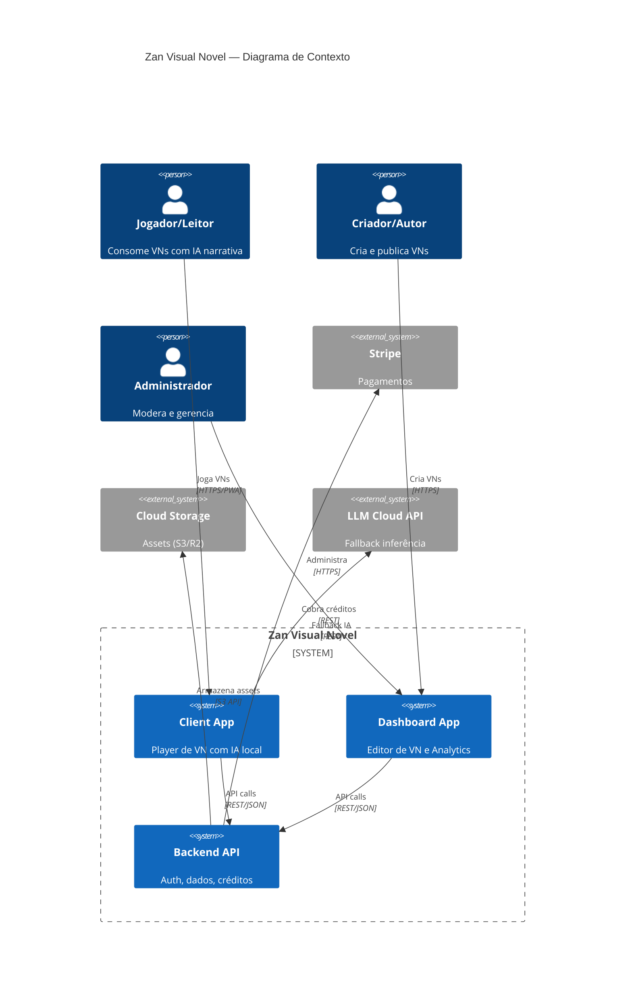
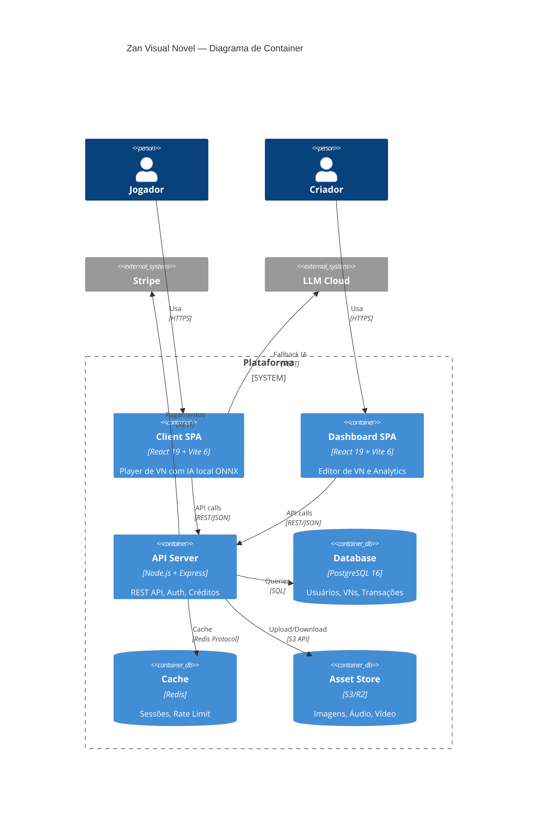
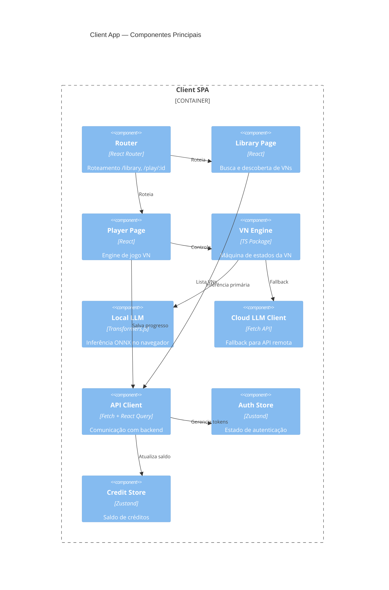
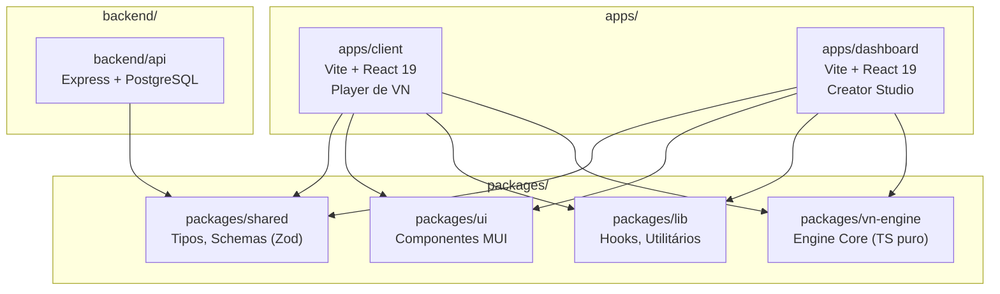

# Diagrama de Arquitetura — Zan Visual Novel

## C4 — Contexto

```mermaid
C4Context
    title Zan Visual Novel — Diagrama de Contexto

    Person(jogador, "Jogador/Leitor", "Consome VNs com IA narrativa")
    Person(criador, "Criador/Autor", "Cria e publica VNs")
    Person(admin, "Administrador", "Modera e gerencia")

    System_Boundary(zvn, "Zan Visual Novel") {
        System(client, "Client App", "Player de VN com IA local")
        System(dashboard, "Dashboard App", "Editor de VN e Analytics")
        System(api, "Backend API", "Auth, dados, créditos")
    }

    System_Ext(stripe, "Stripe", "Pagamentos")
    System_Ext(s3, "Cloud Storage", "Assets (S3/R2)")
    System_Ext(llm, "LLM Cloud API", "Fallback inferência")

    Rel(jogador, client, "Joga VNs", "HTTPS/PWA")
    Rel(criador, dashboard, "Cria VNs", "HTTPS")
    Rel(admin, dashboard, "Administra", "HTTPS")
    Rel(client, api, "API calls", "REST/JSON")
    Rel(dashboard, api, "API calls", "REST/JSON")
    Rel(api, stripe, "Cobra créditos", "REST")
    Rel(api, s3, "Armazena assets", "S3 API")
    Rel(client, llm, "Fallback IA", "REST")
```

## C4 — Container

```mermaid
C4Container
    title Zan Visual Novel — Diagrama de Container

    Person(jogador, "Jogador")
    Person(criador, "Criador")

    System_Boundary(zvn, "Plataforma") {
        Container(spa_client, "Client SPA", "React 19 + Vite 6", "Player de VN com IA local ONNX")
        Container(spa_dash, "Dashboard SPA", "React 19 + Vite 6", "Editor de VN e Analytics")
        Container(api, "API Server", "Node.js + Express", "REST API, Auth, Créditos")
        ContainerDb(db, "Database", "PostgreSQL 16", "Usuários, VNs, Transações")
        ContainerDb(cache, "Cache", "Redis", "Sessões, Rate Limit")
        ContainerDb(assets, "Asset Store", "S3/R2", "Imagens, Áudio, Vídeo")
    }

    System_Ext(stripe, "Stripe")
    System_Ext(llm, "LLM Cloud")

    Rel(jogador, spa_client, "Usa", "HTTPS")
    Rel(criador, spa_dash, "Usa", "HTTPS")
    Rel(spa_client, api, "API calls", "REST/JSON")
    Rel(spa_dash, api, "API calls", "REST/JSON")
    Rel(api, db, "Queries", "SQL")
    Rel(api, cache, "Cache", "Redis Protocol")
    Rel(api, assets, "Upload/Download", "S3 API")
    Rel(api, stripe, "Pagamentos", "REST")
    Rel(spa_client, llm, "Fallback IA", "REST")
```

## C4 — Componente (Client App)

```mermaid
C4Component
    title Client App — Componentes Principais

    Container_Boundary(client, "Client SPA") {
        Component(router, "Router", "React Router", "Roteamento /library, /play/:id")
        Component(library, "Library Page", "React", "Busca e descoberta de VNs")
        Component(player, "Player Page", "React", "Engine de jogo VN")
        Component(vn_engine, "VN Engine", "TS Package", "Máquina de estados da VN")
        Component(llm_local, "Local LLM", "Transformers.js", "Inferência ONNX no navegador")
        Component(llm_cloud, "Cloud LLM Client", "Fetch API", "Fallback para API remota")
        Component(api_client, "API Client", "Fetch + React Query", "Comunicação com backend")
        Component(auth_store, "Auth Store", "Zustand", "Estado de autenticação")
        Component(credit_store, "Credit Store", "Zustand", "Saldo de créditos")
    }

    Rel(router, library, "Roteia")
    Rel(router, player, "Roteia")
    Rel(player, vn_engine, "Controla")
    Rel(vn_engine, llm_local, "Inferência primária")
    Rel(vn_engine, llm_cloud, "Fallback")
    Rel(library, api_client, "Lista VNs")
    Rel(player, api_client, "Salva progresso")
    Rel(api_client, auth_store, "Gerencia tokens")
    Rel(api_client, credit_store, "Atualiza saldo")
```

## Estrutura do Monorepo

```mermaid
graph TD
    subgraph "apps/"
        client["apps/client<br/>Vite + React 19<br/>Player de VN"]
        dashboard["apps/dashboard<br/>Vite + React 19<br/>Creator Studio"]
    end

    subgraph "packages/"
        shared["packages/shared<br/>Tipos, Schemas (Zod)"]
        ui["packages/ui<br/>Componentes MUI"]
        lib["packages/lib<br/>Hooks, Utilitários"]
        engine["packages/vn-engine<br/>Engine Core (TS puro)"]
    end

    subgraph "backend/"
        api["backend/api<br/>Express + PostgreSQL"]
    end

    client --> shared
    client --> ui
    client --> lib
    client --> engine
    dashboard --> shared
    dashboard --> ui
    dashboard --> lib
    dashboard --> engine
    api --> shared
```
