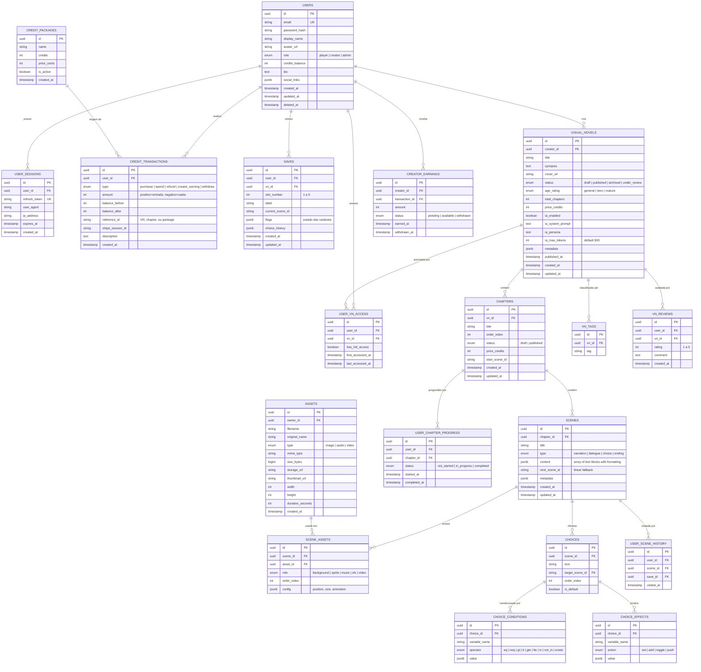

# Modelo de Dados — Diagrama Entidade-Relacionamento (ERD)

## Zan Visual Novel



## Resumo de Cardinalidades

| Entidade A      | Relação          | Entidade B          | Cardinalidade       |
| --------------- | ---------------- | ------------------- | ------------------- |
| USERS           | cria             | VISUAL_NOVELS       | 1:N                 |
| VISUAL_NOVELS   | contém           | CHAPTERS            | 1:N                 |
| CHAPTERS        | contém           | SCENES              | 1:N                 |
| SCENES          | oferece          | CHOICES             | 1:N                 |
| SCENES          | possui           | SCENE_ASSETS        | 1:N                 |
| ASSETS          | usado em         | SCENE_ASSETS        | 1:N                 |
| CHOICES         | condicionada por | CHOICE_CONDITIONS   | 1:N                 |
| CHOICES         | produz           | CHOICE_EFFECTS      | 1:N                 |
| USERS           | possui           | SAVES               | 1:N                 |
| USERS           | acessa           | USER_VN_ACCESS      | 1:N (M:N implícito) |
| USERS           | realiza          | CREDIT_TRANSACTIONS | 1:N                 |
| CREDIT_PACKAGES | origem de        | CREDIT_TRANSACTIONS | 1:N                 |

## Índices Recomendados

```sql
-- Busca de VNs
CREATE INDEX idx_vn_status ON visual_novels(status) WHERE status = 'published';
CREATE INDEX idx_vn_creator ON visual_novels(creator_id);
CREATE INDEX idx_vn_tags ON vn_tags(tag);

-- Performance de saves
CREATE INDEX idx_saves_user_vn ON saves(user_id, vn_id);
CREATE UNIQUE INDEX idx_saves_slot ON saves(user_id, vn_id, slot_number);

-- Créditos
CREATE INDEX idx_credit_transactions_user ON credit_transactions(user_id, created_at DESC);
CREATE INDEX idx_creator_earnings_status ON creator_earnings(creator_id, status);

-- Progresso
CREATE INDEX idx_chapter_progress_user ON user_chapter_progress(user_id, chapter_id);
CREATE INDEX idx_vn_access_user ON user_vn_access(user_id, vn_id);
```
