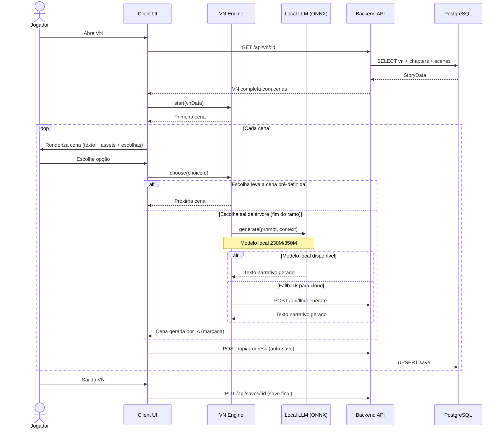
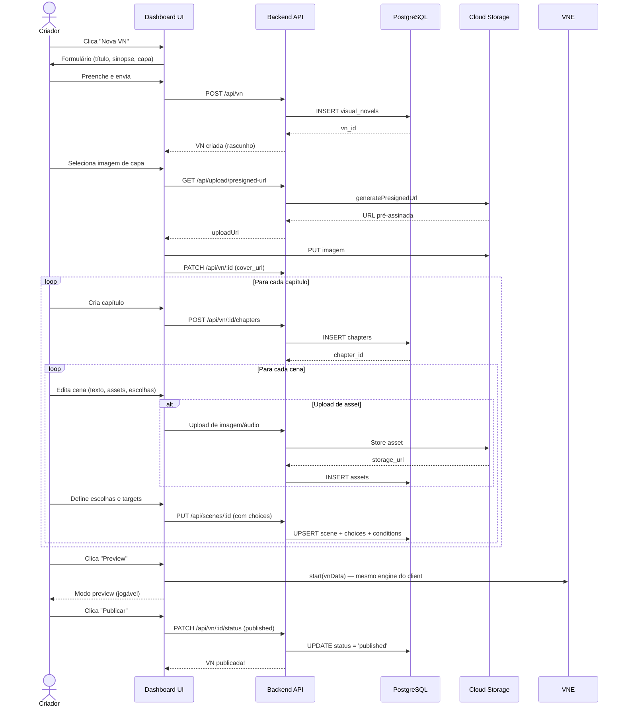
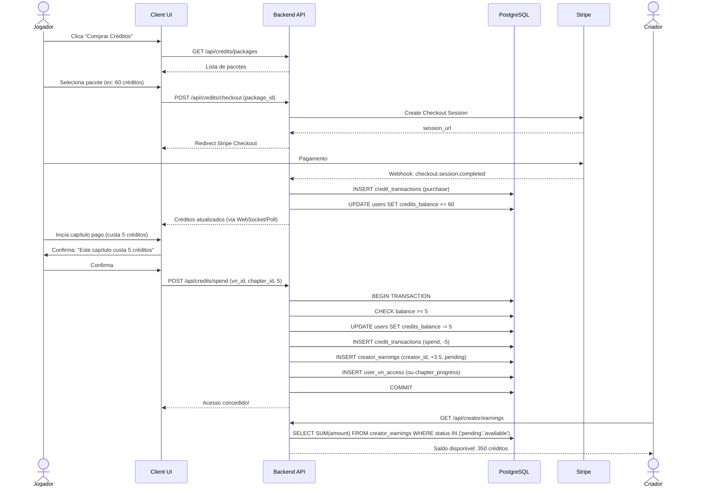
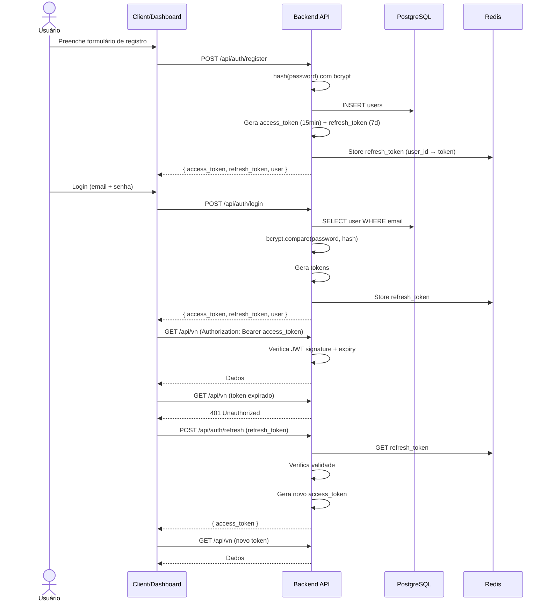

# Diagramas de Sequência — Fluxos Principais

## Zan Visual Novel

---

## 1. Fluxo de Jogo (Player — Interação com IA)

---

## 2. Fluxo de Criação de VN (Dashboard)

---

## 3. Fluxo de Compra e Gasto de Créditos

---

## 4. Fluxo de Autenticação (OAuth2 + JWT)

