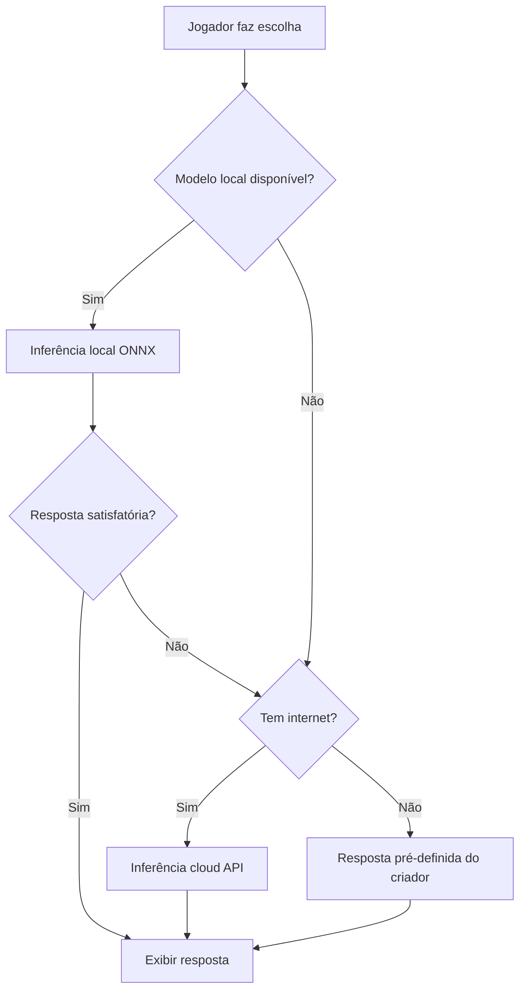
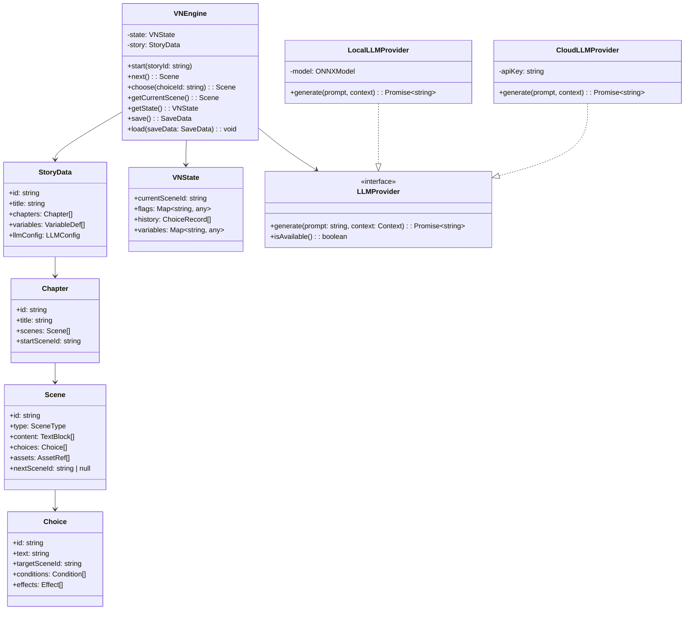

# ADR-001: Arquitetura Monorepo com Cliente Híbrido (Local + Cloud)

**Data:** 2026-07-25  
**Status:** Proposta  
**Autor:** Software Engineer

---

## Contexto

O Zan Visual Novel precisa atender dois perfis de usuário distintos (jogador e criador) com requisitos técnicos diferentes:
- **Client (Jogador):** Precisa rodar LLMs localmente no navegador (inferência ONNX via Transformers.js) com fallback para cloud
- **Dashboard (Criador):** Precisa de editor visual de árvore de decisão, upload de assets e analytics
- Ambos compartilham tipos, schemas, componentes UI e lógica de negócio

## Decisão

**Usaremos monorepo com Turborepo** com a seguinte estrutura:

```
zan-visual-novel/
├── apps/
│   ├── client/          # Vite + React 19 — Player de VN
│   └── dashboard/       # Vite + React 19 — Editor/Creator Studio
├── packages/
│   ├── shared/          # Tipos, Schemas (Zod), Constantes
│   ├── ui/              # Componentes MUI reutilizáveis
│   ├── lib/             # Hooks, utilitários, clientes API
│   └── vn-engine/       # Engine de Visual Novel (core, agnóstico de UI)
├── backend/
│   └── api/             # Node.js + Express/Fastify + PostgreSQL
└── tooling/
    ├── eslint-config/
    └── tsconfig/
```

## Alternativas Consideradas

| Alternativa | Prós | Contras | Decisão |
|-------------|------|---------|---------|
| **Monorepo com Turborepo** | Compartilhamento de código, builds independentes, deploy separado por subdomínio | Complexidade inicial de configuração | ✅ Escolhida |
| Monorepo com Nx | Mais features, caching avançado | Mais pesado, curva de aprendizado maior | ❌ |
| Dois repositórios separados | Simplicidade | Duplicação de código, tipos, CI/CD duplicado | ❌ |
| Single SPA com rotas | Simplicidade máxima | Deploy único, difícil separar subdomínios depois | ❌ |

## Consequências

### Positivas
- **Tipos compartilhados:** Um único source of truth para tipos TypeScript entre client, dashboard e backend
- **Componentes reutilizáveis:** UI kit compartilhado garante consistência visual
- **VN Engine isolado:** O core da engine de visual novel (máquina de estados, árvore, parser) é um pacote puro, testável independentemente
- **Deploy independente:** Cada app pode ser deployado em subdomínios diferentes com builds otimizados
- **CI/CD eficiente:** Turborepo faz cache de builds e testes; só reconstrói o que mudou

### Negativas
- **Complexidade de setup:** Configuração inicial de Turborepo, paths, aliases
- **Versionamento interno:** Pacotes compartilhados precisam de versionamento coordenado
- **Build cross-package:** Mudanças em `shared` triggam rebuild de todos os apps

---

# ADR-002: Inferência Híbrida — Modelos Locais com Fallback Cloud

**Data:** 2026-07-25  
**Status:** Proposta  
**Autor:** Software Engineer

---

## Contexto

O sistema precisa executar LLMs para gerar continuidade narrativa. Temos duas opções:
- **100% Local:** Modelos LFM ONNX rodando via Transformers.js no navegador
- **100% Cloud:** API de inferência remota

## Decisão

**Arquitetura híbrida:** modelo local como primário, cloud como fallback e para modelos grandes.

### Matriz de Decisão por Modelo

| Modelo | Execução | Justificativa |
|--------|----------|---------------|
| LFM2.5-230M-ONNX | **Local (navegador)** | ~200MB Q4, rápido, cabe em qualquer dispositivo |
| LFM2.5-350M-ONNX | **Local (navegador)** | ~350MB Q4, balanceado, maioria dos dispositivos |
| LFM2.5-1.2B-Thinking | **Cloud API** | ~1.2GB Q4, muito pesado para navegador; raciocínio complexo |
| LFM2.5-Audio-1.5B | **Cloud API** | ~3GB, impossível no navegador |
| LFM2.5-VL-450M | **Local (navegador)** | ~900MB, factível em dispositivos modernos |
| LFM2.5-VL-1.6B | **Cloud API** | ~3.2GB, muito pesado |

### Estratégia de Fallback



## Alternativas Consideradas

| Alternativa | Prós | Contras | Decisão |
|-------------|------|---------|---------|
| **Híbrida local+cloud** | Melhor experiência, fallback robusto, modelos grandes quando necessário | Complexidade de orquestração, custo cloud | ✅ Escolhida |
| 100% local | Privacidade total, sem custo de API | Limitado a modelos pequenos (~350M), experiência inferior | ❌ |
| 100% cloud | Melhor qualidade, sem preocupação com device | Custo recorrente, latência de rede, dependência de internet | ❌ |

## Consequências

### Positivas
- **Experiência progressiva:** Jogador começa instantaneamente com modelo local; qualidade escala com hardware
- **Custo otimizado:** Cloud só é usada quando necessário (modelos grandes ou fallback)
- **Offline first:** Funcionalidade básica mantida sem internet

### Negativas
- **Complexidade de orquestração:** Dois caminhos de inferência para manter
- **Consistência:** Respostas do modelo local vs cloud podem divergir em qualidade/tom
- **Cache e custo:** Cloud precisa de cache agressivo para evitar custos repetidos

---

# ADR-003: Engine de Visual Novel como Pacote Independente

**Data:** 2026-07-25  
**Status:** Proposta  
**Autor:** Software Engineer

---

## Contexto

O coração do sistema é a engine que interpreta e executa visual novels — máquina de estados que navega entre cenas, avalia condições, processa escolhas e invoca IA. Essa engine é usada tanto pelo Client (para jogar) quanto pelo Dashboard (para preview).

## Decisão

**A VN Engine será um pacote TypeScript puro (`packages/vn-engine`), sem dependências de UI ou framework.**

### Arquitetura da Engine



## Consequências

### Positivas
- **Testável:** Engine pura pode ser testada com Jest/Vitest sem DOM
- **Reutilizável:** Mesmo código para Client (jogar) e Dashboard (preview)
- **Portável:** Pode ser usado em outros projetos ou empacotado como lib independente
- **Framework-agnostic:** Se migrarmos de React no futuro, a engine não muda

### Negativas
- **Indireção extra:** Adaptadores/bridges necessários para conectar engine à UI React
- **Sincronização de estado:** Estado da engine vs estado React precisam ser mantidos em sync

---

# ADR-004: Backend — Node.js + PostgreSQL + S3

**Data:** 2026-07-25  
**Status:** Proposta  
**Autor:** Software Engineer

---

## Contexto

Precisamos de um backend para: autenticação, persistência de VNs/dados de usuário, gestão de créditos, upload de assets e analytics. O projeto Zan IA de referência é 100% client-side com Google Sheets — mas este projeto tem requisitos que vão além (créditos, transações financeiras, upload de assets pesados).

## Decisão

**Backend próprio com Node.js + Express, PostgreSQL e S3-compatible storage.**

| Componente | Tecnologia | Justificativa |
|------------|-----------|---------------|
| **Runtime** | Node.js 20+ | Mesmo ecossistema do frontend; compartilha tipos |
| **Framework** | Express.js (MVP) → Fastify (scale) | Express é simples e familiar; Fastify para performance futura |
| **Banco** | PostgreSQL 16 | Relacional: usuários, VNs, transações de crédito (ACID essencial) |
| **Cache** | Redis | Sessões, rate limiting, cache de queries frequentes |
| **Assets** | S3-compatible (Cloudflare R2 / AWS S3) | Imagens, áudio, vídeo; CDN para distribuição |
| **ORM** | Drizzle ORM | Type-safe, lightweight, migrations declarativas |
| **Auth** | JWT (access + refresh) + OAuth2 social | Stateless, escalável |
| **Pagamento** | Stripe | Maduro, suporta Brasil, webhooks para créditos |
| **API Docs** | OpenAPI 3.0 (Swagger) | Documentação interativa; geração de tipos |

## Alternativas Consideradas

| Alternativa | Prós | Contras | Decisão |
|-------------|------|---------|---------|
| **Backend próprio** | Controle total, ACID, escalável, adequado para créditos | Mais trabalho inicial | ✅ Escolhida |
| Google Sheets (como Zan IA) | Zero infra, gratuito, simples | Sem ACID, inviável para transações financeiras, sem auth real | ❌ |
| Supabase | Rápido, Postgres + Auth built-in | Vendor lock-in, limites no free tier, menos controle | ❌ |
| Firebase | Rápido, realtime | NoSQL não adequado para transações financeiras, vendor lock-in | ❌ |

## Consequências

### Positivas
- **ACID:** Transações de crédito seguras e consistentes
- **Controle total:** Sem vendor lock-in; pode migrar entre clouds
- **Escalável:** PostgreSQL escala vertical e horizontal (read replicas)
- **Tipos compartilhados:** Schemas Drizzle geram tipos TypeScript usados no frontend

### Negativas
- **Infra para gerenciar:** Servidor, banco, Redis, S3 — mais complexidade operacional
- **Custo:** Diferente de "gratuito" (Sheets), tem custo de hospedagem
- **DevOps:** Precisa de CI/CD, backups, monitoramento
