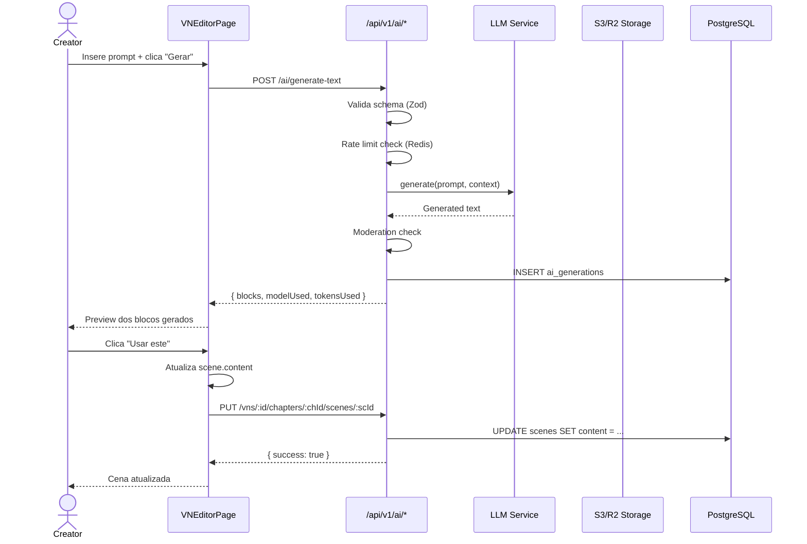
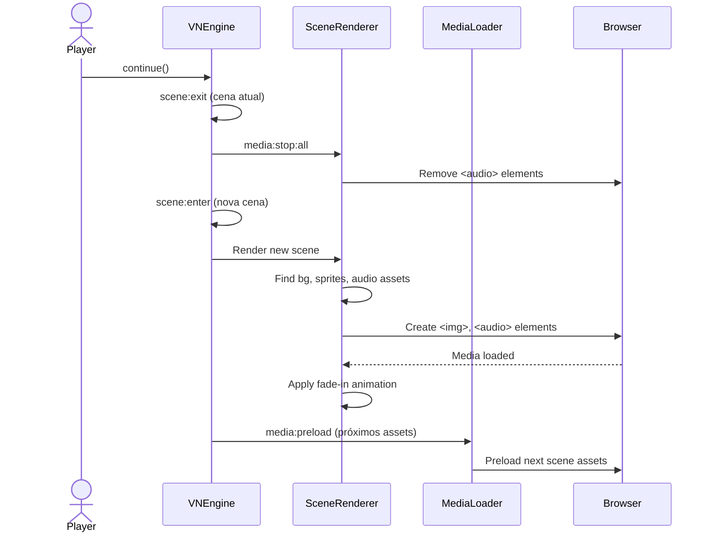

# SRS: Suporte a Mídia Imersiva e Criação Assistida por IA

**Versão:** 1.0  
**Status:** Draft  
**Autor:** Software Engineer Agent  
**Data:** 2026-07-30  
**Branch:** `improve/llm-model-ux-pt2`  
**Documento complementar:** `media-and-ai-assistance-prd.md`

---

## 1. Introdução

### 1.1 Propósito

Este documento especifica os requisitos de software (SRS — Software Requirements Specification) para duas capacidades complementares da plataforma **zan-visual-novel**:

1. **Mídia Imersiva:** Exibição e playback de imagens (backgrounds, sprites) e áudio (música, SFX, TTS) no player de visual novel
2. **Criação Assistida por IA:** Geração de texto, voz (TTS) e imagens por inteligência artificial no studio de criação

### 1.2 Escopo

O escopo cobre:
- **Módulo Player** (`apps/client/src/pages/player-page.tsx` + `packages/ui/src/scene-renderer.tsx` + `packages/vn-engine/`)
- **Módulo Studio** (`apps/dashboard/src/pages/vn-editor-page.tsx` + novas seções de geração IA)
- **Módulo Backend** (`backend/api/src/routes/` — extensões em `assets.routes.ts`, `llm.routes.ts`, `vn.routes.ts`)
- **Pacotes Compartilhados** (`packages/shared/src/types/`, `packages/shared/src/schemas/`)

Fora do escopo:
- Geração procedural de música
- Sincronização labial (lip-sync)
- Edição colaborativa em tempo real
- Animações de personagem (Live2D/spine)

### 1.3 Definições e Acrônimos

| Termo | Definição |
|---|---|
| **VN** | Visual Novel |
| **TTS** | Text-to-Speech (conversão de texto em fala) |
| **LLM** | Large Language Model |
| **LFM** | Liquid Foundation Model (família ONNX) |
| **SFX** | Sound Effects (efeitos sonoros) |
| **SceneAsset** | Registro que associa um Asset a uma Scene com role e config |
| **AssetConfig** | Configuração de renderização/playback de um SceneAsset |
| **IA** | Inteligência Artificial (usado como prefixo em campos: `iaEnabled`, `iaSystemPrompt`) |

### 1.4 Referências

| Ref | Documento | Localização |
|---|---|---|
| [1] | Tipos compartilhados (Asset, SceneAsset, Scene, etc.) | `packages/shared/src/types/index.ts` |
| [2] | Schemas Zod (validação) | `packages/shared/src/schemas/index.ts` |
| [3] | DB Schema (Drizzle ORM) | `backend/api/src/db/schema.ts` |
| [4] | VN Engine core | `packages/vn-engine/src/engine.ts` |
| [5] | Scene Renderer | `packages/ui/src/scene-renderer.tsx` |
| [6] | Player Page | `apps/client/src/pages/player-page.tsx` |
| [7] | VN Editor Page | `apps/dashboard/src/pages/vn-editor-page.tsx` |
| [8] | Assets Router | `backend/api/src/routes/assets.routes.ts` |
| [9] | LLM Router | `backend/api/src/routes/llm.routes.ts` |
| [10] | LLM Provider Interface | `packages/vn-engine/src/llm-provider.ts` |
| [11] | PRD complementar | `.github/artifacts/requirements/media-and-ai-assistance-prd.md` |

---

## 2. Descrição Geral

### 2.1 Perspectiva do Produto

O sistema é um monorepo Turborepo com a seguinte arquitetura:

```
apps/client (Player)     apps/dashboard (Studio)
      │                        │
      ▼                        ▼
packages/ui (SceneRenderer, ChoicePanel, etc.)
packages/lib (hooks: useVNEngine, useLLM)
packages/vn-engine (VNEngine core, ILLMProvider)
packages/shared (types, schemas, constants)
      │                        │
      └────────┬───────────────┘
               ▼
       backend/api (Express + Drizzle + PostgreSQL)
```

Os novos requisitos afetam todas as camadas:
- **`packages/shared`**: Novos tipos e schemas para TTS, geração de imagem, e extensão de tipos existentes
- **`packages/vn-engine`**: Novos eventos de engine para controle de mídia, nova interface `IMediaProvider`
- **`packages/ui`**: Extensão do `SceneRenderer` para transições e controles de áudio
- **`packages/lib`**: Novos hooks `useMediaLoader`, `useAIGeneration`
- **`apps/client`**: Integração de mídia no `PlayerPage`
- **`apps/dashboard`**: Novo painel de geração IA no `VNEditorPage`
- **`backend/api`**: Novos endpoints de geração TTS, imagem, e extensão de assets

### 2.2 Funções do Produto

| Função | Descrição |
|---|---|
| **F-MEDIA-01:** Renderização de background | Exibir imagem de fundo em tela cheia (full-bleed) com overlay de texto |
| **F-MEDIA-02:** Renderização de sprites** | Exibir sprites de personagens com posição, tamanho e opacidade configuráveis |
| **F-MEDIA-03:** Playback de música** | Tocar arquivo de áudio em loop durante a cena |
| **F-MEDIA-04:** Playback de SFX** | Tocar efeito sonoro uma vez (não-loop) em trigger de cena |
| **F-MEDIA-05:** Playback de TTS** | Tocar narração por voz sincronizada com bloco de diálogo |
| **F-MEDIA-06:** Pré-carregamento** | Carregar assets da próxima cena antes da transição |
| **F-MEDIA-07:** Transições** | Animar entrada/saída de mídia (fade in/out) |
| **F-IA-01:** Geração de texto** | Gerar blocos de texto (narração, diálogo, pensamento) via LLM a partir de prompt |
| **F-IA-02:** Geração de TTS** | Gerar arquivo de áudio a partir de texto de diálogo |
| **F-IA-03:** Geração de imagem (background)** | Gerar imagem de fundo a partir de descrição textual |
| **F-IA-04:** Geração de imagem (sprite)** | Gerar sprite de personagem a partir de descrição textual |
| **F-IA-05:** Associação à cena** | Vincular conteúdo gerado automaticamente à cena atual |
| **F-IA-06:** Preview e confirmação** | Exibir preview do conteúdo gerado e permitir confirmar/regenerar |

### 2.3 Características do Usuário

| Tipo | Perfil Técnico | Interage com |
|---|---|---|
| **Criador** | Escritor/designer, conhecimento básico de interface web | Dashboard: editor de VN, painel de geração IA, asset manager |
| **Jogador** | Usuário final, nenhum conhecimento técnico necessário | Client: player de VN com mídia |
| **Admin** | Técnico, gerencia plataforma | Dashboard admin: moderação de conteúdo, analytics |

### 2.4 Restrições

- **Plataforma:** Web (navegadores modernos: Chrome 90+, Firefox 90+, Safari 15+, Edge 90+)
- **Linguagens:** TypeScript (strict mode), SQL (PostgreSQL via Drizzle)
- **Runtime:** Node.js 20+ (backend), Navegador (frontend)
- **Armazenamento:** PostgreSQL (metadados), S3-compatible (Cloudflare R2 — arquivos de mídia)
- **Cache:** Redis (cache de prompts LLM, rate limiting)
- **Modelos IA:** Família LFM 2.5 ONNX (local) + APIs cloud (fallback)
- **Licenciamento:** Conteúdo gerado por IA deve ser marcado como tal (`generatedBy: 'ai'`)

---

## 3. Requisitos Específicos

### 3.1 Requisitos Funcionais — Mídia Imersiva

---

#### RF-MEDIA-001: Exibição de Background por Cena

**Prioridade:** Must  
**Descrição:** O player deve exibir uma imagem de fundo (background) associada à cena atual. Se nenhum background estiver definido, exibe fundo padrão (cor sólida ou gradiente).

**Pré-condições:**
- Cena carregada com `scene.assets` contendo ao menos um `SceneAsset` com `role === 'background'`
- Asset referenciado existe e está acessível via `storageUrl`

**Fluxo Principal:**
1. Engine emite evento `scene:enter` com `sceneId`
2. `SceneRenderer` busca `scene.assets.find(a => a.role === 'background')`
3. Se encontrado, renderiza `` com `src={baseAssetUrl + asset.storageUrl}`
4. Aplica classe CSS `vn-scene__background` para full-bleed
5. Exibe overlay semitransparente (`vn-scene__background-overlay`) para legibilidade do texto

**Fluxo Alternativo (sem background):**
1. Nenhum asset com role `background` → fundo padrão (CSS `background-color` do tema)

**Pós-condições:**
- Background visível no player
- Overlay de texto legível sobre a imagem

**Integração existente:** `SceneRenderer` já implementa parcialmente (linhas ~30-50 de `scene-renderer.tsx`)

**Critérios de Aceitação:**
- [ ] Dado uma cena com `SceneAsset` role=background, Quando a cena é exibida, Então a imagem de fundo cobre toda a área do player
- [ ] Dado uma cena sem background, Quando a cena é exibida, Então um fundo padrão é exibido
- [ ] Dado uma imagem de background, Quando a URL é inválida, Então um fallback é exibido sem quebrar o player

---

#### RF-MEDIA-002: Exibição de Sprites com Posicionamento

**Prioridade:** Must  
**Descrição:** O player deve exibir sprites de personagens sobre o background, com posição, tamanho e opacidade definidos pelo `AssetConfig` da associação `SceneAsset`.

**Pré-condições:**
- `scene.assets` contém `SceneAsset` com `role === 'sprite'`
- Cada sprite tem `config.position` (x, y em %) e opcionalmente `config.size` e `config.opacity`

**Fluxo Principal:**
1. `SceneRenderer` filtra `spriteAssets = scene.assets.filter(a => a.role === 'sprite')`
2. Para cada sprite, renderiza `` com `style` inline:
   - `left: config.position.x%`
   - `top: config.position.y%` (ou `bottom` para alinhamento inferior)
   - `opacity: config.opacity`
   - `maxHeight: config.size.height px`
3. Sprites são posicionados absolutamente dentro do container `.vn-scene__visuals`

**Integração existente:** `SceneRenderer` já implementa parcialmente (linhas ~52-68 de `scene-renderer.tsx`)

**Critérios de Aceitação:**
- [ ] Dado sprites com posição (20%, 50%), Quando a cena renderiza, Então os sprites aparecem nas coordenadas corretas
- [ ] Dado sprite sem posição definida, Quando renderiza, Então usa posição padrão (centralizado, base)
- [ ] Dado múltiplos sprites, Quando renderizam, Então a ordem de empilhamento respeita `orderIndex`

---

#### RF-MEDIA-003: Playback de Música de Fundo com Loop

**Prioridade:** Must  
**Descrição:** O player deve iniciar a reprodução de música de fundo (background music) ao entrar em uma cena que possui `SceneAsset` com `role === 'music'`. A música deve tocar em loop contínuo.

**Pré-condições:**
- `scene.assets` contém `SceneAsset` com `role === 'music'`
- `config.loop !== false` (padrão: true para música) e `config.autoplay !== false`

**Fluxo Principal:**
1. `SceneRenderer` encontra `musicAssets = scene.assets.filter(a => a.role === 'music')`
2. Renderiza `<audio loop autoplay>` com `src={baseAssetUrl + asset.storageUrl}`
3. Browser inicia playback automaticamente (autoplay pode ser bloqueado até primeira interação do usuário)
4. Ao sair da cena (`scene:exit`), o elemento `<audio>` é removido, interrompendo o playback

**Tratamento de Autoplay:**
- Se o navegador bloquear autoplay, o engine deve iniciar o playback na primeira interação do usuário (clique em "Continuar" ou escolha)

**Critérios de Aceitação:**
- [ ] Dado cena com música, Quando jogador entra na cena, Então música inicia em loop
- [ ] Dado transição para cena sem música, Quando cena anterior tinha música, Então música anterior para
- [ ] Dado navegador bloqueia autoplay, Quando usuário clica pela primeira vez, Então música inicia

---

#### RF-MEDIA-004: Playback de Efeitos Sonoros (SFX)

**Prioridade:** Should  
**Descrição:** O player deve tocar efeitos sonoros associados à cena. SFX tocam uma vez (sem loop) e podem ser disparados em momentos específicos.

**Pré-condições:**
- `scene.assets` contém `SceneAsset` com `role === 'sfx'`
- `config.loop === false` e `config.autoplay === true` (padrão para SFX)

**Fluxo Principal:**
1. `SceneRenderer` encontra `sfxAssets = scene.assets.filter(a => a.role === 'sfx')`
2. Renderiza `<audio autoplay>` (sem `loop`)
3. SFX toca uma vez e para naturalmente

**Critérios de Aceitação:**
- [ ] Dado cena com SFX, Quando cena inicia, Então SFX toca uma vez
- [ ] Dado SFX em loop (config inesperado), Quando config.loop é true, Então SFX toca em loop

---

#### RF-MEDIA-005: Pré-carregamento de Mídia

**Prioridade:** Must  
**Descrição:** O player deve pré-carregar assets de mídia da próxima cena antes da transição, para evitar atrasos de carregamento visíveis ao jogador.

**Pré-condições:**
- Cena atual tem `nextSceneId` ou há choices com `targetSceneId` conhecidos
- Assets referenciados existem

**Fluxo Principal:**
1. Ao entrar na cena atual, engine identifica próximas cenas possíveis (via `nextSceneId` + `choices[].targetSceneId`)
2. Engine emite evento `media:preload` com lista de `assetUrls`
3. `useMediaLoader` hook (novo) cria elementos `<link rel="preload">` ou faz fetch dos assets
4. Assets são cacheados pelo browser (cache HTTP ou service worker)
5. Na transição, assets já estão em cache → renderização instantânea

**Estratégia de Implementação:**
- Hook `useMediaLoader` em `packages/lib/src/hooks/use-media-loader.ts`
- Usar `new Image()` para preload de imagens e `new Audio()` para preload de áudio
- Priorizar assets da cena com maior probabilidade (nextSceneId > primeira choice)

**Critérios de Aceitação:**
- [ ] Dado cena A → cena B com background de 2 MB, Quando jogador está na cena A, Então background da cena B é pré-carregado
- [ ] Dado pré-carregamento concluído, Quando jogador avança para cena B, Então a transição é imediata (< 100ms)

---

#### RF-MEDIA-006: Transições Animadas de Mídia

**Prioridade:** Should  
**Descrição:** Transições entre cenas com mídia devem ser animadas (fade in/out) em vez de trocas abruptas.

**Pré-condições:**
- `AssetConfig.animation` definido como `'fadeIn'`, `'slideIn'`, ou `'none'`
- Navegador suporta CSS transitions/animations

**Fluxo Principal:**
1. Ao trocar de cena, `SceneRenderer` aplica classe CSS `vn-scene--exiting` à cena atual (fade out)
2. Aguarda fim da animação (evento `transitionend` ou timeout)
3. Renderiza nova cena com classe `vn-scene--entering` (fade in)
4. Remove classes de animação após conclusão

**Critérios de Aceitação:**
- [ ] Dado transição entre cenas, Quando `config.animation === 'fadeIn'`, Então há fade out (300ms) + fade in (300ms)
- [ ] Dado `config.animation === 'none'`, Quando transição, Então troca é imediata

---

#### RF-MEDIA-007: Controles de Áudio Independentes

**Prioridade:** Could  
**Descrição:** O jogador deve poder controlar o volume de música, SFX e voz (TTS) separadamente através de um menu de configurações de áudio no player.

**Pré-condições:**
- Player está ativo
- Há elementos de áudio em reprodução

**Fluxo Principal:**
1. Jogador acessa menu de configurações (ícone ⚙️ no player)
2. Ajusta sliders: Música (0-100%), SFX (0-100%), Voz (0-100%)
3. Valores persistidos em `localStorage`
4. Elementos `<audio>` têm `volume` ajustado via `HTMLMediaElement.volume`
5. `SceneRenderer` aplica volumes ao criar/atualizar elementos de áudio

**Critérios de Aceitação:**
- [ ] Dado volume de música em 50%, Quando música toca, Então volume é 50% do máximo
- [ ] Dado volume de SFX em 0%, Quando SFX deveria tocar, Então SFX é silenciado
- [ ] Dado configurações salvas, Quando jogador retorna, Então volumes são restaurados

---

### 3.2 Requisitos Funcionais — Criação Assistida por IA

---

#### RF-IA-001: Geração de Texto Narrativo

**Prioridade:** Must  
**Descrição:** O criador deve poder gerar blocos de texto (narração, diálogo, pensamento) para uma cena através de um prompt textual, usando o LLM já integrado na plataforma.

**Pré-condições:**
- VN aberta no editor (`VNEditorPage`)
- Cena selecionada
- IA habilitada para a VN (`iaEnabled === true`)
- Criador autenticado (rate limiting por usuário)

**Fluxo Principal:**
1. Criador seleciona tipo de geração: "Texto" (dropdown: Narração | Diálogo | Pensamento)
2. Criador insere prompt no campo de texto (ex: "Descreva a chegada do herói ao castelo abandonado")
3. Opcional: seleciona personagem para diálogo (speaker)
4. Clica "Gerar"
5. Frontend chama `POST /api/v1/ai/generate-text` com:
   ```json
   {
     "type": "narration",
     "prompt": "Descreva a chegada do herói ao castelo abandonado",
     "context": {
       "vnId": "...",
       "chapterId": "...",
       "sceneId": "...",
       "characterNames": ["Herói", "Vilão"],
       "previousContent": "texto da cena atual..."
     },
     "config": {
       "modelType": "lfm-350m",
       "temperature": 0.7,
       "maxTokens": 500
     }
   }
   ```
6. Backend gera via `cloud-llm.ts` ou `local-llm.ts` (reusa infraestrutura existente em `llm.routes.ts`)
7. Resposta:
   ```json
   {
     "success": true,
     "data": {
       "blocks": [
         { "type": "narration", "text": "O herói aproximou-se...", "style": "normal" }
       ],
       "modelUsed": "lfm-350m",
       "tokensUsed": 120,
       "generatedBy": "ai"
     }
   }
   ```
8. Frontend exibe preview dos blocos gerados
9. Criador clica "Usar este" → blocos são inseridos no `scene.content` atual
10. Criador pode "Regenerar" para obter nova versão

**Integração com código existente:**
- Reusa `LLMGenerateRequest` / `LLMGenerateResponse` de `packages/shared/src/types/index.ts`
- Reusa `llmGenerateSchema` de `packages/shared/src/schemas/index.ts`
- Reusa `generateCloudLLM()` de `backend/api/src/lib/llm/cloud-llm.ts`
- Novo endpoint: `POST /api/v1/ai/generate-text`

**Critérios de Aceitação:**
- [ ] Dado prompt "descreva um jardim", Quando criador clica Gerar, Então preview mostra texto narrativo em < 10s
- [ ] Dado texto gerado, Quando criador clica "Usar este", Então blocos são adicionados ao `scene.content`
- [ ] Dado texto gerado, Quando criador clica "Regenerar", Então novo texto é gerado substituindo o preview
- [ ] Dado erro na geração, Quando API falha, Então mensagem de erro clara é exibida com opção de tentar novamente

---

#### RF-IA-002: Geração de TTS para Diálogo

**Prioridade:** Must  
**Descrição:** O criador deve poder gerar narração por voz (TTS) para um bloco de diálogo específico, produzindo um arquivo de áudio associado ao `TextBlock`.

**Pré-condições:**
- Bloco de texto do tipo `dialogue` selecionado no editor
- `speaker` definido no bloco
- IA habilitada para a VN

**Fluxo Principal:**
1. Criador seleciona bloco de diálogo no editor
2. Clica "Gerar Voz" (ícone 🔊) ao lado do bloco
3. Frontend chama `POST /api/v1/ai/generate-tts` com:
   ```json
   {
     "text": "Olá, bem-vindo ao meu castelo!",
     "speaker": "Herói",
     "voice": "pt-BR-male-1",
     "vnId": "...",
     "sceneId": "..."
   }
   ```
4. Backend gera TTS via:
   - **Cloud:** API LFM2.5-Audio ou serviço externo de TTS
   - **Local:** Transformers.js com modelo TTS (futuro)
5. Áudio gerado é armazenado como asset (`type: 'audio'`, metadata com `generatedBy: 'ai'`, `ttsForBlock: blockIndex`)
6. Resposta retorna `assetId` e `storageUrl`
7. Frontend reproduz preview do áudio
8. Criador confirma → `SceneAsset` é criado vinculando asset ao bloco de diálogo

**Modelo de Dados — Extensão de SceneAsset:**
```typescript
// Extensão do AssetConfig para TTS
interface TTSAssetConfig extends AssetConfig {
  /** Índice do bloco de texto (0-based) ao qual o TTS está vinculado */
  ttsForBlockIndex?: number;
  /** Identificador do locutor (speaker) */
  ttsSpeaker?: string;
  /** Idioma/voz usada na geração */
  ttsVoice?: string;
}
```

**Critérios de Aceitação:**
- [ ] Dado bloco de diálogo "Olá!", Quando criador gera TTS, Então áudio é gerado em < 15s
- [ ] Dado TTS gerado, Quando criador confirma, Então asset é vinculado à cena como SFX ou role dedicado `tts`
- [ ] Dado preview de TTS, Quando áudio toca, Então criador pode ouvir antes de confirmar

---

#### RF-IA-003: Geração de Imagem de Background

**Prioridade:** Must  
**Descrição:** O criador deve poder gerar uma imagem de background para a cena atual a partir de uma descrição textual.

**Pré-condições:**
- Cena selecionada no editor
- IA habilitada

**Fluxo Principal:**
1. Criador seleciona tipo de geração: "Background"
2. Insere prompt (ex: "Castelo abandonado ao pôr do sol, estilo anime, 1920x1080")
3. Opcional: seleciona estilo predefinido (Anime, Realista, Pixel Art, Sketch)
4. Clica "Gerar"
5. Frontend chama `POST /api/v1/ai/generate-image` com:
   ```json
   {
     "type": "background",
     "prompt": "Castelo abandonado ao pôr do sol, estilo anime",
     "style": "anime",
     "size": { "width": 1920, "height": 1080 },
     "vnId": "...",
     "sceneId": "..."
   }
   ```
6. Backend gera imagem via API cloud (LFM2.5-VL-1.6B ou serviço externo como Stability AI / DALL-E)
7. Imagem é baixada, redimensionada se necessário, e armazenada como asset (`type: 'image'`, `mimeType: 'image/png'`)
8. `SceneAsset` é criado automaticamente com `role: 'background'`
9. Resposta retorna preview + `assetId`
10. Criador vê preview inline no editor
11. Criador confirma ou regenera

**Novo Endpoint: `POST /api/v1/ai/generate-image`**

**Request Schema:**
```typescript
const generateImageSchema = z.object({
  type: z.enum(['background', 'sprite']),
  prompt: z.string().min(1).max(1000),
  style: z.enum(['anime', 'realistic', 'pixel-art', 'sketch']).default('anime'),
  size: z.object({
    width: z.number().int().min(256).max(2048).default(1920),
    height: z.number().int().min(256).max(2048).default(1080),
  }).optional(),
  negativePrompt: z.string().max(500).optional(),
  vnId: z.string().uuid(),
  sceneId: z.string().uuid(),
});
```

**Critérios de Aceitação:**
- [ ] Dado prompt "floresta noturna", Quando criador gera, Então imagem é exibida como preview em < 30s
- [ ] Dado imagem gerada, Quando criador confirma, Então background da cena é atualizado
- [ ] Dado geração de imagem, Quando tamanho excede 1920×1080, Então imagem é redimensionada server-side
- [ ] Dado erro na API de imagem, Quando geração falha, Então mensagem de erro + opção de tentar novamente

---

#### RF-IA-004: Geração de Sprite de Personagem

**Prioridade:** Must  
**Descrição:** O criador deve poder gerar um sprite de personagem a partir de descrição textual, com fundo transparente quando possível.

**Pré-condições:**
- Cena selecionada
- IA habilitada

**Fluxo Principal:**
1. Criador seleciona tipo: "Sprite"
2. Insere prompt (ex: "Guerreiro de armadura prateada, corpo inteiro, fundo transparente")
3. Seleciona posição inicial (esquerda, centro, direita)
4. Clica "Gerar"
5. Similar ao fluxo de background (RF-IA-003), mas com `type: 'sprite'`
6. Backend tenta gerar com fundo transparente (PNG alpha channel)
7. `SceneAsset` criado com `role: 'sprite'` e `config.position` predefinido

**Critérios de Aceitação:**
- [ ] Dado prompt "elfa arqueira", Quando criador gera, Então sprite aparece com fundo transparente
- [ ] Dado sprite gerado, Quando posição é "esquerda", Então `config.position` é `{ x: 20, y: 50 }`
- [ ] Dado sprite gerado, Quando criador confirma, Então sprite aparece no preview da cena

---

#### RF-IA-005: Painel de Geração IA no Editor

**Prioridade:** Must  
**Descrição:** O editor de VN deve ter um painel dedicado para geração por IA, acessível via tab "IA" ou botão flutuante, integrado ao fluxo de edição de cena.

**Pré-condições:**
- `VNEditorPage` renderizado
- Cena selecionada
- `iaEnabled === true` para a VN

**Fluxo Principal:**
1. Criador abre tab "IA" ou clica botão 🤖 no editor de cena
2. Painel exibe três abas/segmentos: **Texto** | **Voz (TTS)** | **Imagem**
3. Cada aba tem:
   - Campo de prompt textual
   - Seletores de configuração (tipo, estilo, voz)
   - Botão "Gerar" com indicador de progresso
   - Área de preview com opções "Usar este" / "Regenerar"
4. Geração acontece em background (não bloqueia edição)
5. Resultados aparecem na área de preview
6. Confirmação associa automaticamente à cena

**Componentes novos:**
- `AIGenerationPanel.tsx` em `apps/dashboard/src/components/`
- Subcomponentes: `TextGenerationTab`, `TTSGenerationTab`, `ImageGenerationTab`

**Integração:**
- Adicionar tab `'ia'` ao estado `tab` do `VNEditorPage` (já existe `TabValue = 'details' | 'chapters' | 'scenes' | 'graph' | 'ia' | 'preview'`)
- A tab `'ia'` já está definida no tipo `TabValue`!

**Critérios de Aceitação:**
- [ ] Dado editor de cena aberto, Quando criador clica tab "IA", Então painel de geração é exibido
- [ ] Dado painel aberto, Quando criador alterna entre Texto/Voz/Imagem, Então interface muda adequadamente
- [ ] Dado geração em andamento, Quando criador muda de tab, Então geração continua em background

---

#### RF-IA-006: Histórico de Gerações

**Prioridade:** Could  
**Descrição:** O criador deve poder visualizar o histórico de gerações de IA feitas para uma VN, com possibilidade de reutilizar ou excluir gerações anteriores.

**Pré-condições:**
- VN aberta no editor
- Pelo menos uma geração de IA já realizada

**Fluxo Principal:**
1. Criador acessa seção "Histórico" no painel de IA
2. Lista chronological de gerações com: tipo, prompt, data, preview thumbnail
3. Clica em item → expande detalhes
4. Opções: "Reutilizar" (abre prompt original) ou "Excluir"

**Modelo de Dados (novo):**
```sql
CREATE TABLE ai_generations (
  id UUID PRIMARY KEY DEFAULT gen_random_uuid(),
  vn_id UUID NOT NULL REFERENCES visual_novels(id),
  scene_id UUID REFERENCES scenes(id),
  creator_id UUID NOT NULL REFERENCES users(id),
  type VARCHAR(20) NOT NULL, -- 'text', 'tts', 'image'
  prompt TEXT NOT NULL,
  result_asset_id UUID REFERENCES assets(id),
  result_text JSONB, -- armazena TextBlock[] para type='text'
  model_used VARCHAR(50),
  tokens_used INTEGER,
  created_at TIMESTAMP DEFAULT NOW()
);
```

**Critérios de Aceitação:**
- [ ] Dado 5 gerações anteriores, Quando criador abre histórico, Então lista mostra as 5 com preview
- [ ] Dado item de histórico, Quando criador clica "Reutilizar", Então prompt original é carregado no painel

---

### 3.3 Requisitos Não-Funcionais

#### RNF-01: Performance

| ID | Requisito | Valor |
|---|---|---|
| RNF-P01 | Tempo de resposta da API de geração de texto | P95 < 10s |
| RNF-P02 | Tempo de resposta da API de geração de TTS | P95 < 15s (até 500 chars) |
| RNF-P03 | Tempo de resposta da API de geração de imagem | P95 < 30s |
| RNF-P04 | Tempo de carregamento de background no player | P95 < 1s (conexão 10 Mbps) |
| RNF-P05 | Pré-carregamento de assets da próxima cena | Concluído antes da transição |
| RNF-P06 | Latência de início de áudio após scene:enter | < 300ms |

#### RNF-02: Segurança

| ID | Requisito |
|---|---|
| RNF-S01 | Rate limiting: 20 req/min para `/ai/generate-text`, 10 req/min para `/ai/generate-image`, 10 req/min para `/ai/generate-tts` |
| RNF-S02 | Autenticação JWT obrigatória em todos os endpoints `/ai/*` (middleware `authenticate` já existente) |
| RNF-S03 | Moderação de conteúdo: verificação de texto gerado contra lista de termos proibidos antes de retornar ao frontend |
| RNF-S04 | Sanitização de prompts: escape de HTML/JS injection nos campos de prompt |
| RNF-S05 | Log de todas as gerações para auditoria (já parcialmente existente via Redis cache key) |

#### RNF-03: Confiabilidade

| ID | Requisito |
|---|---|
| RNF-R01 | Fallback automático: se API cloud de imagem falhar, tentar provider alternativo |
| RNF-R02 | Retry com exponential backoff (máx. 3 tentativas) para chamadas de geração |
| RNF-R03 | Cache de resultados de geração idênticos (Redis, TTL 1h — já existe para LLM) |
| RNF-R04 | Timeout de 60s para chamadas de geração (evitar requests pendurados) |

#### RNF-04: Manutenibilidade

| ID | Requisito |
|---|---|
| RNF-M01 | Novos providers de IA devem implementar interfaces TypeScript definidas em `packages/vn-engine/src/` |
| RNF-M02 | Schemas Zod para todos os novos endpoints (padrão existente) |
| RNF-M03 | Cobertura de testes ≥ 80% para novos módulos de geração |
| RNF-M04 | Documentação de API atualizada (OpenAPI/Swagger ou README nos routers) |

---

## 4. Modelos de Dados

### 4.1 Extensões a Tipos Existentes

#### `AssetConfig` (em `packages/shared/src/types/index.ts`)

```typescript
// Extensão: adicionar campos para TTS
export interface AssetConfig {
  position?: { x: number; y: number };
  size?: { width: number; height: number };
  opacity?: number;
  animation?: 'fadeIn' | 'slideIn' | 'none';
  loop?: boolean;
  autoplay?: boolean;
  // ── NOVOS ──
  /** Volume relativo (0.0 a 1.0). Default: 1.0 */
  volume?: number;
  /** Índice do TextBlock ao qual o TTS está vinculado */
  ttsForBlockIndex?: number;
  /** Identificador da voz TTS */
  ttsVoice?: string;
  /** Delay em ms antes de iniciar o playback */
  delay?: number;
}
```

#### `AssetRole` (em `packages/shared/src/types/index.ts`)

```typescript
// Extensão: adicionar role 'tts'
export type AssetRole = 'background' | 'sprite' | 'music' | 'sfx' | 'tts' | 'video';
```

#### `SceneAsset` — sem alterações estruturais, mas `config` passa a suportar os novos campos

### 4.2 Novos Tipos

#### `AIGenerationRequest` e variantes

```typescript
// Em packages/shared/src/types/index.ts

export type AIGenerationType = 'text' | 'tts' | 'image';

export type AIGenerationStatus = 'pending' | 'processing' | 'completed' | 'failed';

export interface AIGenerationRequest {
  vnId: string;
  sceneId: string;
  type: AIGenerationType;
  prompt: string;
  config?: Record<string, unknown>;
}

export interface AITextGenerationRequest extends AIGenerationRequest {
  type: 'text';
  config: {
    blockType: 'narration' | 'dialogue' | 'thought';
    speaker?: string;
    modelType?: LLMModelType;
    temperature?: number;
    maxTokens?: number;
    style?: 'normal' | 'italic' | 'bold';
  };
}

export interface AITTSGenerationRequest extends AIGenerationRequest {
  type: 'tts';
  config: {
    text: string;
    speaker: string;
    voice: string;
    blockIndex: number;
  };
}

export interface AIImageGenerationRequest extends AIGenerationRequest {
  type: 'image';
  config: {
    imageType: 'background' | 'sprite';
    style: 'anime' | 'realistic' | 'pixel-art' | 'sketch';
    size?: { width: number; height: number };
    negativePrompt?: string;
  };
}

export interface AIGenerationResponse {
  id: string;
  type: AIGenerationType;
  status: AIGenerationStatus;
  // Para texto
  blocks?: TextBlock[];
  // Para TTS e imagem
  assetId?: string;
  assetUrl?: string;
  // Metadados
  modelUsed: string;
  tokensUsed?: number;
  duration: number;
  generatedBy: 'ai';
}

export interface AIGenerationRecord {
  id: string;
  vnId: string;
  sceneId: string | null;
  creatorId: string;
  type: AIGenerationType;
  prompt: string;
  resultAssetId: string | null;
  resultText: TextBlock[] | null;
  modelUsed: string;
  tokensUsed: number | null;
  status: AIGenerationStatus;
  createdAt: string;
}
```

### 4.3 Extensões ao Banco de Dados (Drizzle Schema)

```typescript
// Em backend/api/src/db/schema.ts — NOVAS TABELAS

// ── AI Generations ─────────────────────────────────────

export const aiGenerations = pgTable('ai_generations', {
  id: uuid('id').defaultRandom().primaryKey(),
  vnId: uuid('vn_id')
    .notNull()
    .references(() => visualNovels.id, { onDelete: 'cascade' }),
  sceneId: uuid('scene_id').references(() => scenes.id, { onDelete: 'set null' }),
  creatorId: uuid('creator_id')
    .notNull()
    .references(() => users.id),
  type: varchar('type', { length: 20 }).notNull(), // 'text' | 'tts' | 'image'
  prompt: text('prompt').notNull(),
  resultAssetId: uuid('result_asset_id').references(() => assets.id, { onDelete: 'set null' }),
  resultText: jsonb('result_text'), // TextBlock[]
  modelUsed: varchar('model_used', { length: 100 }),
  tokensUsed: integer('tokens_used'),
  status: varchar('status', { length: 20 }).notNull().default('completed'),
  createdAt: timestamp('created_at').notNull().defaultNow(),
}, (table) => [
  index('idx_ai_gen_vn').on(table.vnId),
  index('idx_ai_gen_creator').on(table.creatorId),
]);

// ── Extensão da tabela assets ──────────────────────────
// Adicionar campo generated_by (já pode usar metadata jsonb existente)
// O campo `metadata` jsonb dos assets pode armazenar:
// { generatedBy: 'ai', generationId: '...', prompt: '...', model: '...' }
```

### 4.4 Extensões ao Schema de Cena

Cenas geradas ou modificadas por IA devem ter metadados no campo `metadata` (jsonb):

```typescript
interface SceneAIMetadata {
  generatedBy?: 'ai' | 'human';
  generationIds?: string[];  // Referências para ai_generations
  lastAIAction?: 'text_generated' | 'tts_generated' | 'image_generated';
  lastAITimestamp?: string;
}
```

---

## 5. API Surface

### 5.1 Endpoints Existentes (Reutilizados)

| Método | Rota | Uso |
|---|---|---|
| `POST` | `/api/v1/assets` | Upload de assets (já existe) — usado para salvar imagens e TTS gerados |
| `GET` | `/api/v1/assets` | Listar assets do usuário |
| `DELETE` | `/api/v1/assets/:id` | Deletar asset |
| `POST` | `/api/v1/llm/generate` | Geração de texto cloud (autenticado) |
| `POST` | `/api/v1/llm/local` | Geração de texto local (público) |
| `POST` | `/api/v1/vns/:vnId/chapters/:chId/scenes/:scId/choices` | Criar choice |
| `PUT` | `/api/v1/vns/:vnId/chapters/:chId/scenes/:scId` | Atualizar cena |

### 5.2 Novos Endpoints

#### `POST /api/v1/ai/generate-text`

Gera blocos de texto narrativo para uma cena.

**Request:**
```json
{
  "type": "narration",
  "prompt": "Descreva a chegada ao castelo",
  "context": {
    "vnId": "uuid",
    "sceneId": "uuid",
    "characterNames": ["Herói"],
    "previousContent": "..."
  },
  "config": {
    "modelType": "lfm-350m",
    "temperature": 0.7,
    "maxTokens": 500,
    "style": "normal"
  }
}
```

**Response (200):**
```json
{
  "success": true,
  "data": {
    "id": "gen-uuid",
    "type": "text",
    "blocks": [
      { "type": "narration", "text": "Ao aproximar-se do castelo...", "style": "normal" }
    ],
    "modelUsed": "lfm-350m",
    "tokensUsed": 85,
    "duration": 3200,
    "generatedBy": "ai"
  }
}
```

**Router:** `backend/api/src/routes/ai.routes.ts` (novo arquivo)

---

#### `POST /api/v1/ai/generate-tts`

Gera narração por voz para um texto de diálogo.

**Request:**
```json
{
  "text": "Bem-vindo ao meu reino!",
  "speaker": "Rei",
  "voice": "pt-BR-male-deep",
  "vnId": "uuid",
  "sceneId": "uuid",
  "blockIndex": 2
}
```

**Response (200):**
```json
{
  "success": true,
  "data": {
    "id": "gen-uuid",
    "type": "tts",
    "assetId": "asset-uuid",
    "assetUrl": "/uploads/tts/abc123.mp3",
    "durationMs": 3200,
    "modelUsed": "lfm-audio-1.5b",
    "generatedBy": "ai"
  }
}
```

---

#### `POST /api/v1/ai/generate-image`

Gera imagem (background ou sprite) por descrição textual.

**Request:**
```json
{
  "type": "background",
  "prompt": "Floresta noturna com névoa, estilo anime",
  "style": "anime",
  "size": { "width": 1920, "height": 1080 },
  "negativePrompt": "blurry, low quality",
  "vnId": "uuid",
  "sceneId": "uuid"
}
```

**Response (200):**
```json
{
  "success": true,
  "data": {
    "id": "gen-uuid",
    "type": "image",
    "assetId": "asset-uuid",
    "assetUrl": "/uploads/images/gen/def456.png",
    "width": 1920,
    "height": 1080,
    "modelUsed": "lfm-vl-1.6b",
    "duration": 18500,
    "generatedBy": "ai"
  }
}
```

---

#### `GET /api/v1/ai/generations?vnId={uuid}`

Lista histórico de gerações para uma VN.

**Response (200):**
```json
{
  "success": true,
  "data": [
    {
      "id": "gen-uuid",
      "type": "image",
      "prompt": "Floresta noturna...",
      "resultAssetId": "asset-uuid",
      "modelUsed": "lfm-vl-1.6b",
      "status": "completed",
      "createdAt": "2026-07-30T12:00:00Z"
    }
  ]
}
```

---

#### `DELETE /api/v1/ai/generations/:id`

Remove um registro de geração (não remove o asset associado).

**Response (200):**
```json
{
  "success": true,
  "data": { "deleted": true }
}
```

---

### 5.3 Estrutura de Arquivos Novos/Modificados

```
backend/api/src/routes/
  ai.routes.ts          ← NOVO: endpoints de geração IA
  assets.routes.ts      ← MODIFICADO: suporte a TTS role
  llm.routes.ts         ← MODIFICADO: refatorado para reuso em ai.routes.ts

backend/api/src/lib/
  ai/
    image-generation.ts ← NOVO: integração com API de imagem
    tts-generation.ts   ← NOVO: integração com API de TTS
    moderation.ts       ← NOVO: moderação de conteúdo gerado

packages/shared/src/
  types/
    ai-generation.ts    ← NOVO: tipos AIGeneration*
    index.ts            ← MODIFICADO: export novos tipos, AssetRole extend
  schemas/
    ai-generation.ts    ← NOVO: schemas Zod
    index.ts            ← MODIFICADO: export novos schemas

packages/vn-engine/src/
  types.ts              ← MODIFICADO: novos eventos ('media:preload', 'media:play', etc.)

packages/ui/src/
  scene-renderer.tsx    ← MODIFICADO: transições, controles de áudio, TTS
  ai-generation-panel.tsx ← NOVO (opcional, pode ficar em apps/dashboard)

packages/lib/src/hooks/
  use-media-loader.ts   ← NOVO: hook de pré-carregamento
  use-ai-generation.ts  ← NOVO: hook de geração IA

apps/dashboard/src/
  components/
    ai-generation/      ← NOVO: componentes do painel IA
      index.tsx
      text-tab.tsx
      tts-tab.tsx
      image-tab.tsx
      history-panel.tsx
  pages/
    vn-editor-page.tsx  ← MODIFICADO: integração do painel IA

apps/client/src/
  pages/
    player-page.tsx     ← MODIFICADO: integração do useMediaLoader
  components/
    audio-controls.tsx  ← NOVO: controles de volume
```

---

## 6. Pontos de Integração

### 6.1 Engine ↔ Renderer

```
VNEngine                    SceneRenderer
   │                             │
   ├─ scene:enter ──────────────►│ renderiza cena + mídia
   ├─ media:preload ────────────►│ pré-carrega próximos assets
   ├─ media:play:music ─────────►│ inicia música
   ├─ media:play:sfx ───────────►│ toca SFX
   ├─ media:stop:all ───────────►│ para toda mídia
   │                             │
```

**Novos eventos do Engine:**
```typescript
export type EngineEventType =
  // ... existentes ...
  | 'media:preload'      // payload: { assetUrls: string[] }
  | 'media:play:music'   // payload: { assetUrl: string, volume: number }
  | 'media:play:sfx'     // payload: { assetUrl: string, volume: number }
  | 'media:play:tts'     // payload: { assetUrl: string, blockIndex: number }
  | 'media:stop:all'     // payload: void
  | 'media:volume:change'; // payload: { channel: 'music'|'sfx'|'tts', volume: number }
```

### 6.2 Editor ↔ API de IA

```
VNEditorPage                  API Backend
   │                               │
   ├─ AI Generation Panel          │
   │  ├─ TextTab ───POST──────────►│ /ai/generate-text → LLM cloud/local
   │  ├─ TTSTab ────POST──────────►│ /ai/generate-tts → TTS service
   │  └─ ImageTab ──POST──────────►│ /ai/generate-image → Image service
   │                               │
   ├─ Preview ←─────JSON───────────┤
   ├─ Confirm → atualiza scene     │
   └─ Save → PUT /vns/:id/...     │
```

### 6.3 Player ↔ Carregamento de Mídia

```
PlayerPage                    VNEngine + SceneRenderer
   │                               │
   ├─ useMediaLoader hook          │
   │  ├─ scene:enter ─────────────►│ identifica próximos assets
   │  ├─ preload images ──────────►│ new Image() para cada URL
   │  ├─ preload audio ───────────►│ new Audio() para cada URL
   │  └─ cache complete ──────────►│
   │                               │
   ├─ onContinue ─────────────────►│ scene:exit → media:stop:all
   │                               │ scene:enter → render new media
```

### 6.4 Stack Tecnológica para Geração IA

| Tipo | Provider Primário | Provider Fallback |
|---|---|---|
| **Texto** | LFM2.5-350M (local WebGPU) | LFM cloud API (`llm.routes.ts`) |
| **TTS** | LFM2.5-Audio cloud API | ElevenLabs API (futuro) |
| **Imagem** | LFM2.5-VL-1.6B cloud API | Stability AI / Replicate (futuro) |

---

## 7. Matriz de Rastreabilidade

| RF | US Relacionada | Prioridade | Pacote/Módulo | Issue |
|---|---|---|---|---|
| RF-MEDIA-001 | US-M01 | Must | `packages/ui/scene-renderer.tsx` | — |
| RF-MEDIA-002 | US-M02 | Must | `packages/ui/scene-renderer.tsx` | — |
| RF-MEDIA-003 | US-M03 | Must | `packages/ui/scene-renderer.tsx` | — |
| RF-MEDIA-004 | US-M04 | Should | `packages/ui/scene-renderer.tsx` | — |
| RF-MEDIA-005 | US-M08 | Must | `packages/lib/hooks/use-media-loader.ts` | — |
| RF-MEDIA-006 | US-M06 | Should | `packages/ui/scene-renderer.tsx` | — |
| RF-MEDIA-007 | US-M07 | Could | `apps/client/components/audio-controls.tsx` | — |
| RF-IA-001 | US-A01 | Must | `backend/api/src/routes/ai.routes.ts`, `apps/dashboard` | — |
| RF-IA-002 | US-A03 | Must | `backend/api/src/routes/ai.routes.ts`, TTS lib | — |
| RF-IA-003 | US-A04 | Must | `backend/api/src/routes/ai.routes.ts`, image lib | — |
| RF-IA-004 | US-A05 | Must | `backend/api/src/routes/ai.routes.ts`, image lib | — |
| RF-IA-005 | US-A07 | Must | `apps/dashboard/src/pages/vn-editor-page.tsx` | — |
| RF-IA-006 | US-A08 | Could | `apps/dashboard/components/ai-generation/` | — |

---

## 8. Apêndices

### A. Diagrama de Componentes — Fluxo de Geração IA



### B. Diagrama de Sequência — Playback de Mídia no Player



---

> **Próximo passo:** Handoff para o pipeline de desenvolvimento — criação de issues, milestones, e planejamento de sprints com base neste SRS e no PRD complementar.
