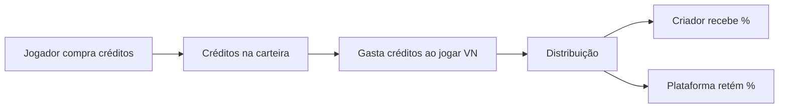

# Documento de Visão do Produto — Zan Visual Novel

**Versão:** 1.0  
**Data:** 2026-07-25  
**Status:** Draft  
**Autor:** Software Engineer

---

## 1. Visão Geral

### 1.1 Nome do Produto
**Zan Visual Novel** — Plataforma de Criação e Consumo de Visual Novels Interativas com IA Generativa

### 1.2 Propósito
Uma plataforma que permite a **criadores** construir e publicar visual novels interativas (histórias com escolhas, cenas, imagens, áudio e vídeo) e a **jogadores** consumir essas histórias com continuidade dinâmica gerada por IA local (LLMs LFM rodando no navegador), criando experiências narrativas personalizadas e imprevisíveis.

### 1.3 Problema que Resolve
- **Criadores de conteúdo narrativo** não têm ferramentas acessíveis para criar visual novels interativas sem conhecimento de programação ou engines complexas (Ren'Py, Unity, etc.)
- **Jogadores/leitores** têm experiências lineares — mesmo VNs com escolhas são limitadas a ramificações pré-escritas
- A **monetização** de conteúdo narrativo interativo é fragmentada e depende de plataformas centralizadas (Steam, itch.io)

### 1.4 Proposta de Valor
| Para | Valor Entregue |
|------|---------------|
| **Criadores (Dashboard)** | Ferramenta no-code/low-code para criar VNs com capítulos, cenas, assets multimídia e árvores de decisão. Sistema de créditos para monetização. |
| **Jogadores (Client)** | Experiência imersiva de leitura interativa com IA local que gera continuidade narrativa além das escolhas pré-definidas. Progresso salvo, escolhas com consequências. |
| **Plataforma** | Ecossistema autossustentável — criadores produzem conteúdo, jogadores consomem e pagam créditos, criadores são recompensados. |

---

## 2. Personas

### 2.1 Criador de Conteúdo (Dashboard User)
- **Nome:** "Autor Z"
- **Perfil:** Escritor, roteirista, ou entusiasta de storytelling. Não tem conhecimento técnico profundo.
- **Objetivos:** Criar e publicar visual novels, gerenciar capítulos, ver métricas de consumo, receber créditos.
- **Dores:** Ferramentas atuais são complexas (Ren'Py, Twine) ou limitadas (Wattpad, Medium).

### 2.2 Jogador / Leitor (Client User)
- **Nome:** "Leitora V"
- **Perfil:** Consumidora de conteúdo narrativo interativo. Gosta de mangá, light novels, dating sims, RPGs narrativos.
- **Objetivos:** Descobrir e jogar/ler visual novels, fazer escolhas que impactam a história, ter experiências únicas com IA.
- **Dores:** Visual novels tradicionais são limitadas a ramificações fixas; quer mais dinamismo e personalização.

### 2.3 Administrador (Super User)
- **Nome:** "Admin Z"
- **Perfil:** Dono da plataforma. Gerencia criadores, políticas de crédito, curadoria de conteúdo.
- **Objetivos:** Moderar conteúdo, gerenciar economia de créditos, analisar métricas da plataforma.

---

## 3. Funcionalidades Principais (Macro)

### 3.1 Client (Jogador)
| ID | Funcionalidade | Descrição |
|----|---------------|-----------|
| CL-01 | Biblioteca de VNs | Navegar, buscar e filtrar visual novels disponíveis |
| CL-02 | Leitor/Player de VN | Engine de renderização de cenas: texto, imagens, áudio, vídeo, escolhas |
| CL-03 | Sistema de Escolhas | Árvore de decisão ramificada com consequências narrativas |
| CL-04 | IA Narrativa Local | LLM LFM local (ONNX) gerando continuidade além das escolhas pré-definidas |
| CL-05 | Sistema de Créditos | Compra e gasto de créditos para acessar histórias |
| CL-06 | Progresso e Saves | Salvar progresso, múltiplos slots, retomar de onde parou |
| CL-07 | Perfil do Jogador | Histórico de leituras, créditos, conquistas |

### 3.2 Dashboard (Criador)
| ID | Funcionalidade | Descrição |
|----|---------------|-----------|
| DS-01 | Gerenciamento de VNs | Criar, editar, publicar, arquivar visual novels |
| DS-02 | Editor de Capítulos | Criar/editar capítulos com cenas, escolhas, condições |
| DS-03 | Asset Manager | Upload e gerenciamento de imagens, áudios, vídeos por cena |
| DS-04 | Editor de Árvore de Decisão | Interface visual para criar ramificações e consequências |
| DS-05 | Configuração de IA | Definir comportamento, persona e restrições do LLM por história |
| DS-06 | Analytics do Criador | Métricas de consumo, créditos recebidos, feedback |
| DS-07 | Perfil do Criador | Bio, portfólio de VNs, extrato de créditos |

### 3.3 Plataforma (Admin)
| ID | Funcionalidade | Descrição |
|----|---------------|-----------|
| AD-01 | Gestão de Usuários | CRUD de usuários, roles, permissões |
| AD-02 | Gestão de Créditos | Políticas de preço, conversão, distribuição |
| AD-03 | Moderação de Conteúdo | Revisão e aprovação de VNs publicadas |
| AD-04 | Analytics Global | Métricas agregadas da plataforma |

---

## 4. Stack Tecnológica (Proposta)

```
┌──────────────────────────────────────────────────┐
│  Monorepo: Turborepo/Nx                           │
│                                                   │
│  ┌─────────────────┐  ┌───────────────────────┐  │
│  │ apps/client      │  │ apps/dashboard         │  │
│  │ React 19 + Vite  │  │ React 19 + Vite 6      │  │
│  │ Transformers.js  │  │ MUI v6                 │  │
│  │ LangChain.js     │  │                        │  │
│  │ MUI v6           │  │                        │  │
│  └────────┬────────┘  └───────────┬───────────┘  │
│           │                       │               │
│  ┌────────┴───────────────────────┴───────────┐  │
│  │ packages/shared                             │  │
│  │ Tipos, Schemas, Hooks, UI Components, Lib   │  │
│  └─────────────────────────────────────────────┘  │
│                                                   │
│  ┌──────────────────────────────────────────────┐ │
│  │ Backend (API)                                 │ │
│  │ Node.js + Express/Fastify  |  PostgreSQL      │ │
│  │ Auth (OAuth 2.0 + JWT)    |  Redis (cache)    │ │
│  │ Stripe (pagamentos)       |  S3 (assets)      │ │
│  └──────────────────────────────────────────────┘ │
└──────────────────────────────────────────────────┘
```

---

## 5. Modelos LFM (Inferência)

| Modelo | Uso | Execução |
|--------|-----|----------|
| LFM2.5-230M-ONNX | Diálogos simples, respostas rápidas | Client-side (navegador) |
| LFM2.5-350M-ONNX | Narrativa balanceada qualidade/velocidade | Client-side (navegador) |
| LFM2.5-1.2B-Thinking-ONNX | Raciocínio narrativo complexo, plot twists | Cloud API (quando disponível) |
| LFM2.5-Audio-1.5B-ONNX | Narração por voz, diálogos falados | Cloud API |
| LFM2.5-VL-450M-ONNX | Análise de cenas, descrição de imagens | Client-side |
| LFM2.5-VL-1.6B-ONNX | Geração de assets visuais, análise completa | Cloud API |

---

## 6. Economia de Créditos (Conceito Inicial)



- **Compra:** Pacotes de créditos via Stripe (R$ X por Y créditos)
- **Gasto:** Cada capítulo ou VN completa custa Z créditos (definido pelo criador)
- **Distribuição:** Criador recebe 70%, Plataforma 30% (configurável)
- **Free tier:** VNs gratuitas ou demos com capítulos iniciais grátis

---

## 7. Métricas de Sucesso (MVP)

| Métrica | Alvo MVP |
|---------|----------|
| Criadores ativos | 10+ |
| VNs publicadas | 20+ |
| Jogadores registrados | 100+ |
| Sessões de leitura/mês | 500+ |
| Tempo médio de sessão | > 15 min |
| Satisfação do jogador (NPS) | > 40 |

---

## 8. Fora do Escopo (MVP)

- ❌ Multi-idioma (apenas PT-BR no MVP)
- ❌ Aplicativo mobile nativo (PWA serve)
- ❌ Multiplayer / VNs colaborativas em tempo real
- ❌ Integração com Steam, itch.io, etc.
- ❌ Voice cloning / TTS avançado
- ❌ Geração de assets por IA (imagens, vídeos)

---

## 9. Riscos

| Risco | Impacto | Probabilidade | Mitigação |
|-------|---------|---------------|-----------|
| Performance de LLM local no navegador | Alto | Média | Fallback para cloud API; modelos quantizados Q4 |
| Custo de cloud API para modelos grandes | Médio | Alta | Rate limiting; cache de respostas; priorizar modelos locais |
| Conteúdo inapropriado gerado por IA | Alto | Média | Filtros de conteúdo; moderação humana; configurações de segurança por criador |
| Baixa adoção de criadores | Alto | Alta | Templates prontos; import de Twine/Ren'Py; comunidade |
| Complexidade do editor de árvore | Médio | Média | UI/UX iterativo; teste com criadores reais desde o início |
