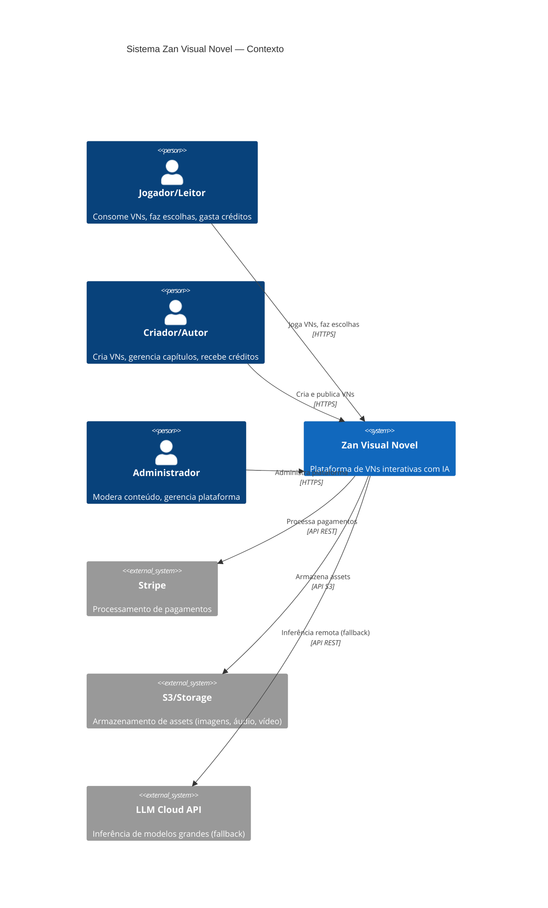

# SRS — Software Requirements Specification

## Zan Visual Novel

**Versão:** 1.0  
**Data:** 2026-07-25  
**Status:** Draft  
**Autor:** Software Engineer  
**Padrão:** IEEE 830 (adaptado)

---

## 1. Introdução

### 1.1 Propósito
Este documento especifica os requisitos funcionais, não-funcionais e regras de negócio da plataforma **Zan Visual Novel** — um sistema de criação e consumo de visual novels interativas com IA generativa local.

### 1.2 Escopo
O sistema é composto por três módulos principais:
- **Client (Player):** Aplicação web para jogadores consumirem visual novels com IA narrativa local
- **Dashboard (Creator):** Aplicação web para criadores gerenciarem suas histórias, capítulos e créditos
- **Backend API:** Servidor para autenticação, persistência, gestão de créditos e distribuição de conteúdo

### 1.3 Definições e Acrônimos
| Termo | Definição |
|-------|-----------|
| VN | Visual Novel — história interativa com escolhas, cenas, assets multimídia |
| LLM | Large Language Model — modelo de linguagem para geração de texto |
| LFM | Liquid Foundation Model — família de modelos da Liquid AI otimizados para on-device |
| ONNX | Open Neural Network Exchange — formato de modelo para inferência cross-platform |
| Crédito | Unidade de valor usada para acessar conteúdo na plataforma |
| Cena | Unidade atômica de uma VN: texto + assets + escolhas |
| Capítulo | Agrupamento de cenas que formam uma unidade narrativa |

### 1.4 Referências
- [Documento de Visão do Produto](./product-vision.md)
- [Zan IA — README (tecnologias de referência)](https://github.com/zan-ia/zan-ia)
- [Liquid AI — LFM Models](https://www.liquid.ai/)

---

## 2. Descrição Geral

### 2.1 Perspectiva do Produto

### 2.2 Funções do Produto (Resumo)
1. **Autenticação e Autorização:** Registro, login, OAuth social, RBAC (jogador, criador, admin)
2. **Player de VN:** Engine de renderização de cenas, sistema de escolhas, IA narrativa local
3. **Editor de VN:** CRUD de histórias, capítulos, cenas, assets, árvore de decisão (Dashboard)
4. **Sistema de Créditos:** Compra, gasto, distribuição, extrato
5. **Descoberta de Conteúdo:** Biblioteca, busca, categorias, recomendações
6. **Analytics:** Métricas de consumo para criadores e plataforma

### 2.3 Características do Usuário
| Tipo | Nível Técnico | Frequência de Uso |
|------|---------------|-------------------|
| Jogador/Leitor | Básico — navegação web | Diária/semanal |
| Criador/Autor | Intermediário — edição de conteúdo | Semanal |
| Administrador | Avançado — gestão de sistemas | Diária |

### 2.4 Restrições
- **Cliente:** Deve rodar nos navegadores Chrome, Firefox, Safari, Edge (últimas 2 versões)
- **Inferência local:** Modelos ONNX devem caber em memória do navegador (< 2 GB)
- **Latência de resposta IA:** < 5s para modelo local (230M), < 15s para cloud
- **Offline:** Player deve funcionar offline após carregar a VN (IA limitada sem cloud)
- **PT-BR:** Interface e conteúdo inicial apenas em português brasileiro

---

## 3. Requisitos Funcionais (RF)

### 3.1 Módulo: Autenticação e Usuários

| ID | Requisito | Prioridade | User Story |
|----|-----------|------------|------------|
| RF-AUTH-001 | O sistema deve permitir registro de novo usuário com email e senha | Must | Como visitante, quero criar uma conta para acessar a plataforma |
| RF-AUTH-002 | O sistema deve permitir login com email e senha | Must | Como usuário registrado, quero fazer login para acessar minhas VNs |
| RF-AUTH-003 | O sistema deve permitir login social (Google, GitHub) | Should | Como visitante, quero usar minha conta Google para registro rápido |
| RF-AUTH-004 | O sistema deve suportar recuperação de senha por email | Must | Como usuário, quero recuperar minha senha se esquecê-la |
| RF-AUTH-005 | O sistema deve atribuir role (player/creator/admin) no registro | Must | — |
| RF-AUTH-006 | O sistema deve permitir que um player se torne creator | Should | Como jogador, quero me tornar criador para publicar minhas próprias VNs |
| RF-AUTH-007 | O sistema deve renovar token JWT automaticamente (refresh token) | Must | — |

### 3.2 Módulo: Client — Player de VN

| ID | Requisito | Prioridade | User Story |
|----|-----------|------------|------------|
| RF-CL-001 | O sistema deve exibir uma biblioteca de VNs disponíveis com busca e filtros | Must | Como jogador, quero explorar VNs disponíveis para escolher o que jogar |
| RF-CL-002 | O sistema deve exibir detalhes de uma VN (sinopse, autor, capítulos, rating, preço em créditos) | Must | Como jogador, quero ver detalhes antes de começar uma VN |
| RF-CL-003 | O sistema deve renderizar cenas com texto formatado (diálogos, narração) | Must | Como jogador, quero ler a história com texto bem apresentado |
| RF-CL-004 | O sistema deve exibir assets visuais (imagens de fundo, sprites de personagens) por cena | Must | Como jogador, quero ver imagens que complementam a narrativa |
| RF-CL-005 | O sistema deve reproduzir áudio (música de fundo, efeitos sonoros) por cena | Should | Como jogador, quero imersão sonora durante a leitura |
| RF-CL-006 | O sistema deve apresentar escolhas ao jogador nos pontos de decisão | Must | Como jogador, quero fazer escolhas que afetam a história |
| RF-CL-007 | O sistema deve navegar entre cenas com base nas escolhas do jogador (árvore de decisão) | Must | Como jogador, quero ver as consequências das minhas escolhas |
| RF-CL-008 | O sistema deve carregar e executar modelo LLM LFM localmente via ONNX (Transformers.js) | Must | Como jogador, quero continuidade narrativa gerada por IA além das escolhas fixas |
| RF-CL-009 | O sistema deve permitir escolher qual modelo LFM usar (230M, 350M, cloud) | Should | Como jogador avançado, quero escolher qualidade vs. velocidade |
| RF-CL-010 | O sistema deve usar LLM para gerar continuidade narrativa quando a história sai da árvore pré-definida | Must | Como jogador, quero que a IA continue a história de forma coerente |
| RF-CL-011 | O sistema deve salvar progresso automaticamente ao final de cada cena | Must | Como jogador, quero não perder meu progresso |
| RF-CL-012 | O sistema deve permitir múltiplos slots de save por VN | Must | Como jogador, quero explorar diferentes ramificações |
| RF-CL-013 | O sistema deve permitir carregar um save anterior | Must | Como jogador, quero retomar de onde parei |
| RF-CL-014 | O sistema deve exibir o custo em créditos antes de iniciar um capítulo pago | Must | Como jogador, quero saber quanto vou gastar |
| RF-CL-015 | O sistema deve deduzir créditos ao iniciar conteúdo pago | Must | — |
| RF-CL-016 | O sistema deve exibir saldo de créditos do jogador | Must | Como jogador, quero ver quantos créditos tenho |
| RF-CL-017 | O sistema deve permitir compra de créditos via Stripe | Must | Como jogador, quero comprar créditos para acessar mais VNs |
| RF-CL-018 | O sistema deve funcionar como PWA (instalável, offline para VNs já carregadas) | Should | Como jogador, quero jogar mesmo sem internet |

### 3.3 Módulo: Dashboard — Editor de VN

| ID | Requisito | Prioridade | User Story |
|----|-----------|------------|------------|
| RF-DS-001 | O sistema deve permitir criar uma nova Visual Novel (título, sinopse, capa, gênero, tags) | Must | Como criador, quero criar uma nova VN para publicar |
| RF-DS-002 | O sistema deve listar todas as VNs do criador com status (rascunho, publicado, arquivado) | Must | Como criador, quero gerenciar minhas VNs |
| RF-DS-003 | O sistema deve permitir editar metadados da VN (título, sinopse, capa, etc.) | Must | Como criador, quero atualizar informações da minha VN |
| RF-DS-004 | O sistema deve permitir criar capítulos dentro de uma VN | Must | Como criador, quero estruturar minha história em capítulos |
| RF-DS-005 | O sistema deve permitir reordenar capítulos (arrastar) | Should | Como criador, quero organizar a ordem dos capítulos |
| RF-DS-006 | O sistema deve permitir criar cenas dentro de um capítulo | Must | Como criador, quero definir cada cena da história |
| RF-DS-007 | O sistema deve oferecer editor de texto rico para conteúdo da cena (diálogos, narração) | Must | Como criador, quero formatar o texto das cenas |
| RF-DS-008 | O sistema deve permitir upload de assets por cena (imagem de fundo, sprites, áudio) | Must | Como criador, quero adicionar recursos visuais e sonoros |
| RF-DS-009 | O sistema deve oferecer editor visual de árvore de decisão (nós e arestas) | Must | Como criador, quero definir as ramificações da história visualmente |
| RF-DS-010 | O sistema deve permitir definir condições para escolhas (flags, itens, escolhas anteriores) | Should | Como criador avançado, quero criar lógica condicional nas ramificações |
| RF-DS-011 | O sistema deve permitir preview da VN (modo jogador) antes de publicar | Must | Como criador, quero testar minha VN antes de publicar |
| RF-DS-012 | O sistema deve permitir publicar/despublicar uma VN | Must | Como criador, quero controlar quando minha VN fica disponível |
| RF-DS-013 | O sistema deve permitir configurar persona e instruções do LLM por VN | Must | Como criador, quero definir o tom e comportamento da IA na minha história |
| RF-DS-014 | O sistema deve permitir definir preço em créditos por capítulo ou VN completa | Must | Como criador, quero monetizar meu conteúdo |
| RF-DS-015 | O sistema deve exibir analytics do criador (visualizações, sessões, créditos recebidos) | Should | Como criador, quero acompanhar o desempenho das minhas VNs |

### 3.4 Módulo: Backend API

| ID | Requisito | Prioridade | User Story |
|----|-----------|------------|------------|
| RF-API-001 | A API deve expor endpoints RESTful para todas as operações CRUD de VNs | Must | — |
| RF-API-002 | A API deve gerenciar autenticação JWT com refresh token | Must | — |
| RF-API-003 | A API deve gerenciar upload de assets para S3 com URLs pré-assinadas | Must | — |
| RF-API-004 | A API deve processar transações de créditos (compra, gasto, distribuição) | Must | — |
| RF-API-005 | A API deve integrar com Stripe para compra de créditos (webhooks) | Must | — |
| RF-API-006 | A API deve expor endpoints de busca e descoberta de VNs | Must | — |
| RF-API-007 | A API deve registrar analytics de consumo (sessões, escolhas, tempo) | Should | — |
| RF-API-008 | A API deve expor endpoint de fallback para inferência LLM cloud | Should | — |

### 3.5 Módulo: Admin

| ID | Requisito | Prioridade | User Story |
|----|-----------|------------|------------|
| RF-AD-001 | O sistema deve permitir listar, buscar e filtrar todos os usuários | Must | Como admin, quero gerenciar usuários da plataforma |
| RF-AD-002 | O sistema deve permitir alterar role de um usuário | Must | Como admin, quero promover/remover criadores |
| RF-AD-003 | O sistema deve permitir banir/suspender usuários | Should | Como admin, quero moderar comportamentos abusivos |
| RF-AD-004 | O sistema deve exibir fila de VNs para revisão antes da publicação | Should | Como admin, quero revisar conteúdo antes de ir ao ar |
| RF-AD-005 | O sistema deve permitir aprovar/rejeitar VN submetida para revisão | Should | Como admin, quero controlar qualidade do conteúdo |
| RF-AD-006 | O sistema deve exibir analytics globais da plataforma | Should | Como admin, quero acompanhar saúde do negócio |
| RF-AD-007 | O sistema deve permitir configurar política de distribuição de créditos (%) | Should | Como admin, quero ajustar a economia da plataforma |

---

## 4. Requisitos Não-Funcionais (RNF)

### 4.1 Performance

| ID | Requisito | Métrica |
|----|-----------|---------|
| RNF-PERF-001 | Tempo de carregamento inicial do client | < 3s (first contentful paint) |
| RNF-PERF-002 | Tempo de carregamento de modelo LFM (230M) | < 10s (com cache IndexedDB) |
| RNF-PERF-003 | Tempo de resposta da IA local (230M) | < 5s por parágrafo |
| RNF-PERF-004 | Tempo de resposta da API | < 200ms (p95) |
| RNF-PERF-005 | Tempo de upload de assets | < 30s para imagens < 10MB |
| RNF-PERF-006 | TTFB (Time to First Byte) | < 100ms |

### 4.2 Escalabilidade

| ID | Requisito | Métrica |
|----|-----------|---------|
| RNF-SCALE-001 | Usuários simultâneos suportados (MVP) | 100 |
| RNF-SCALE-002 | VNs publicadas simultâneas | 1.000 |
| RNF-SCALE-003 | Assets armazenados | 100 GB (MVP) |

### 4.3 Segurança

| ID | Requisito |
|----|-----------|
| RNF-SEC-001 | Senhas devem ser armazenadas com hash bcrypt/argon2 |
| RNF-SEC-002 | Todas as comunicações devem usar HTTPS/TLS 1.3 |
| RNF-SEC-003 | Tokens JWT devem expirar em 15min (access) e 7 dias (refresh) |
| RNF-SEC-004 | Upload de assets deve ter validação de tipo MIME e tamanho máximo (50MB) |
| RNF-SEC-005 | Rate limiting: 100 req/min por IP para endpoints públicos |
| RNF-SEC-006 | Sanitização de entrada contra XSS e injeção em todo conteúdo gerado por IA |
| RNF-SEC-007 | Conteúdo gerado por IA deve passar por filtro de toxicidade/safety |

### 4.4 Usabilidade e Acessibilidade

| ID | Requisito |
|----|-----------|
| RNF-UX-001 | Interface deve seguir Material Design 3 (MUI v6) |
| RNF-UX-002 | Contraste mínimo 4.5:1 para texto normal (WCAG AA) |
| RNF-UX-003 | Navegação completa por teclado |
| RNF-UX-004 | Suporte a leitor de tela para o player de VN (aria-labels) |
| RNF-UX-005 | Responsivo: desktop (1024px+), tablet (768px), mobile (320px) |

### 4.5 Confiabilidade e Disponibilidade

| ID | Requisito | Métrica |
|----|-----------|---------|
| RNF-REL-001 | Uptime da API | 99.5% (MVP) |
| RNF-REL-002 | Backup do banco de dados | Diário, retenção 30 dias |
| RNF-REL-003 | Recuperação de desastres (RTO) | < 4 horas |
| RNF-REL-004 | Perda máxima de dados (RPO) | < 1 hora |

### 4.6 Portabilidade e Compatibilidade

| ID | Requisito |
|----|-----------|
| RNF-PORT-001 | Navegadores: Chrome 120+, Firefox 120+, Safari 17+, Edge 120+ |
| RNF-PORT-002 | WebGL 2.0 necessário para inferência ONNX |
| RNF-PORT-003 | PWA: Service Worker para cache offline |
| RNF-PORT-004 | Node.js 20+ para backend |

---

## 5. Regras de Negócio (RN)

### 5.1 Sistema de Créditos

| ID | Regra |
|----|-------|
| RN-CRED-001 | Créditos são comprados em pacotes: 10 créditos = R$ 5, 25 = R$ 10, 60 = R$ 20, 150 = R$ 50 |
| RN-CRED-002 | Cada VN/capítulo tem preço definido pelo criador (mínimo 1 crédito) |
| RN-CRED-003 | Créditos são deduzidos no momento em que o jogador inicia o conteúdo pago |
| RN-CRED-004 | Se o jogador já pagou por um capítulo, não paga novamente (acesso permanente) |
| RN-CRED-005 | Distribuição padrão: 70% criador, 30% plataforma (configurável por admin) |
| RN-CRED-006 | Créditos do criador podem ser sacados quando atingirem mínimo de 100 créditos |
| RN-CRED-007 | Créditos não expiram |
| RN-CRED-008 | Reembolso: jogador pode solicitar reembolso em até 24h se não avançou além da 2ª cena |

### 5.2 Publicação de Conteúdo

| ID | Regra |
|----|-------|
| RN-PUB-001 | VN deve ter no mínimo 1 capítulo e 2 cenas para ser publicada |
| RN-PUB-002 | Título e sinopse são obrigatórios para publicação |
| RN-PUB-003 | Capa da VN é obrigatória para publicação (ou gerada automaticamente) |
| RN-PUB-004 | Conteúdo ofensivo/ilegal resulta em suspensão do criador |
| RN-PUB-005 | VN publicada pode ser editada, mas alterações significativas exigem nova revisão |
| RN-PUB-006 | Criador pode arquivar VN (não aparece na biblioteca, mas jogadores que já compraram mantêm acesso) |

### 5.3 IA Narrativa

| ID | Regra |
|----|-------|
| RN-IA-001 | A IA só gera continuidade quando o jogador chega ao fim de um ramo pré-definido |
| RN-IA-002 | O criador pode desabilitar IA para capítulos específicos (história 100% linear) |
| RN-IA-003 | O criador define persona, tom e restrições da IA por VN (system prompt) |
| RN-IA-004 | Conteúdo gerado por IA é marcado visualmente para o jogador |
| RN-IA-005 | Cada resposta da IA tem no máximo 500 tokens (controlável pelo criador) |
| RN-IA-006 | Histórico de contexto da IA: últimas 10 interações (para manter coerência) |

### 5.4 Progresso e Saves

| ID | Regra |
|----|-------|
| RN-SAVE-001 | Máximo de 5 slots de save por VN por jogador |
| RN-SAVE-002 | Auto-save ocorre ao final de cada cena (sobrescreve slot "Auto") |
| RN-SAVE-003 | Save inclui: cena atual, flags de estado, histórico de escolhas |
| RN-SAVE-004 | Saves são sincronizados com o servidor (além do LocalStorage) |

---

## 6. Matriz de Rastreabilidade

| RF | User Story | Épico | Milestone |
|----|-----------|-------|-----------|
| RF-AUTH-001..007 | Autenticação e Perfil | Auth | M1 — Fundação |
| RF-CL-001..005 | Biblioteca e Player Base | Client Core | M2 — Player MVP |
| RF-CL-006..013 | Escolhas e Saves | Client Core | M2 — Player MVP |
| RF-CL-008..010 | IA Narrativa Local | Client IA | M3 — IA Integration |
| RF-CL-014..017 | Créditos e Monetização | Monetização | M4 — Economy |
| RF-DS-001..010 | Editor de VN | Creator Studio | M2 — Player MVP |
| RF-DS-011..015 | Preview e Analytics | Creator Studio | M3 — IA Integration |
| RF-API-001..008 | Backend API | Infra | M1 — Fundação |
| RF-AD-001..007 | Admin | Admin | M4 — Economy |
