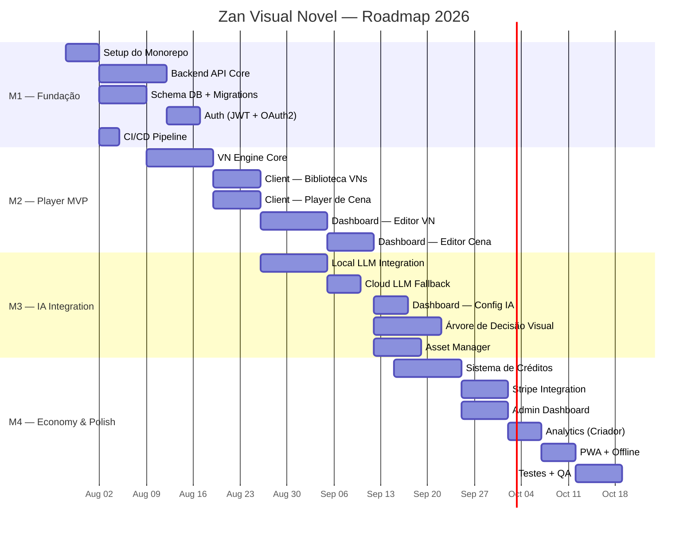

# Roadmap — Zan Visual Novel

**Atualizado:** 2026-07-25  
**Horizonte:** 6 meses (Q3-Q4 2026)

---

## Visão Geral

---

## Milestones

### M1 — Fundação (Jul-Ago 2026)

**Objetivo:** Infraestrutura base para desenvolvimento

| Issue | Título                                              | Prioridade | Épico   |
| ----- | --------------------------------------------------- | ---------- | ------- |
| #1    | Setup do monorepo com Turborepo                     | Must       | Infra   |
| #2    | Configurar ESLint, Prettier, tsconfig compartilhado | Must       | Infra   |
| #3    | Criar pacote `shared` (tipos, schemas Zod)          | Must       | Infra   |
| #4    | Criar schema do banco PostgreSQL (Drizzle ORM)      | Must       | Backend |
| #5    | Implementar API de autenticação (JWT + OAuth2)      | Must       | Backend |
| #6    | Setup CI/CD (GitHub Actions — lint, test, build)    | Must       | Infra   |
| #7    | Configurar Redis para sessões                       | Should     | Backend |
| #8    | Configurar S3/R2 para assets                        | Should     | Backend |

**Definition of Done:**

- [ ] Monorepo funcional com `npm run dev` rodando todos os apps
- [ ] API de auth funcional (register, login, refresh)
- [ ] CI/CD rodando lint + build em PRs

---

### M2 — Player MVP (Ago 2026)

**Objetivo:** Jogador consegue navegar e jogar uma VN linear; criador consegue criar e publicar

| Issue | Título                                              | Prioridade | Épico     |
| ----- | --------------------------------------------------- | ---------- | --------- |
| #10   | Implementar VN Engine core (máquina de estados)     | Must       | Engine    |
| #11   | API CRUD de VNs, capítulos e cenas                  | Must       | Backend   |
| #12   | Client: Página de biblioteca (busca, filtros)       | Must       | Client    |
| #13   | Client: Player de cena (texto, assets básicos)      | Must       | Client    |
| #14   | Client: Sistema de escolhas (navegação entre cenas) | Must       | Client    |
| #15   | Client: Sistema de saves (local + cloud)            | Must       | Client    |
| #16   | Dashboard: CRUD de VN (título, sinopse, capa)       | Must       | Dashboard |
| #17   | Dashboard: Editor de capítulos e cenas              | Must       | Dashboard |
| #18   | Dashboard: Preview da VN (modo jogador)             | Must       | Dashboard |
| #19   | Dashboard: Publicar/despublicar VN                  | Must       | Dashboard |

**Definition of Done:**

- [ ] Jogador consegue buscar VNs publicadas e jogar ao menos 1 capítulo com escolhas
- [ ] Criador consegue criar uma VN com 2 capítulos e publicar
- [ ] Saves funcionam (salvar e carregar)

---

### M3 — IA Integration (Set 2026)

**Objetivo:** IA narrativa local funcionando; editor visual de árvore completo

| Issue | Título                                                     | Prioridade | Épico     |
| ----- | ---------------------------------------------------------- | ---------- | --------- |
| #20   | Integrar Transformers.js + LFM ONNX (230M, 350M)           | Must       | IA        |
| #21   | Criar provider LLM local (Web Worker)                      | Must       | IA        |
| #22   | Criar provider LLM cloud (fallback)                        | Must       | IA        |
| #23   | Integrar IA na VN Engine (geração de continuidade)         | Must       | IA        |
| #24   | Dashboard: Configuração de persona/instruções LLM por VN   | Must       | Dashboard |
| #25   | Dashboard: Editor visual de árvore de decisão (React Flow) | Must       | Dashboard |
| #26   | Dashboard: Condições e efeitos nas escolhas (flags)        | Should     | Dashboard |
| #27   | Dashboard: Asset Manager (upload, preview, organização)    | Must       | Dashboard |
| #28   | Indicador visual de conteúdo gerado por IA no player       | Should     | Client    |

**Definition of Done:**

- [ ] Jogador vê conteúdo gerado por IA ao chegar ao fim de um ramo
- [ ] Criador consegue configurar persona da IA por VN
- [ ] Editor visual de árvore funcional (arrastar nós, criar conexões)

---

### M4 — Economy & Polish (Set-Out 2026)

**Objetivo:** Sistema de créditos, monetização, admin, PWA, testes

| Issue | Título                                                      | Prioridade | Épico     |
| ----- | ----------------------------------------------------------- | ---------- | --------- |
| #30   | API de créditos (compra, gasto, extrato)                    | Must       | Backend   |
| #31   | Integração Stripe (checkout + webhooks)                     | Must       | Backend   |
| #32   | Distribuição automática de créditos (70/30)                 | Must       | Backend   |
| #33   | Client: UI de compra e saldo de créditos                    | Must       | Client    |
| #34   | Client: Confirmação de gasto antes de iniciar capítulo pago | Must       | Client    |
| #35   | Dashboard: Analytics do criador (views, ganhos)             | Should     | Dashboard |
| #36   | Dashboard: Extrato de créditos recebidos                    | Should     | Dashboard |
| #37   | Admin: Gestão de usuários e moderação                       | Should     | Admin     |
| #38   | Admin: Configuração de política de créditos                 | Should     | Admin     |
| #39   | PWA: Service Worker + cache offline                         | Should     | Client    |
| #40   | Testes E2E (Playwright)                                     | Should     | QA        |
| #41   | Testes de carga (k6/Artillery)                              | Could      | QA        |
| #42   | Documentação de API (OpenAPI/Swagger)                       | Should     | Docs      |

**Definition of Done:**

- [ ] Jogador consegue comprar e gastar créditos
- [ ] Criador recebe créditos automaticamente
- [ ] Admin consegue gerenciar usuários e políticas
- [ ] App funciona offline (VNs já carregadas)
- [ ] Cobertura de testes > 80%

---

## Fora do Escopo (v1.0)

- ❌ Multi-idioma (apenas PT-BR)
- ❌ Aplicativo mobile nativo
- ❌ Multiplayer / VNs colaborativas
- ❌ Integração com Steam, itch.io
- ❌ Voice cloning / TTS avançado
- ❌ Geração de assets por IA (imagens, vídeos)
- ❌ Saque de créditos ( apenas acúmulo no MVP)

---

## Métricas de Acompanhamento

| Métrica                 | Alvo M2      | Alvo M3 | Alvo M4 |
| ----------------------- | ------------ | ------- | ------- |
| VNs publicadas          | 5 (teste)    | 15      | 20+     |
| Criadores ativos        | 2 (dev)      | 5       | 10+     |
| Jogadores               | 10 (interno) | 50      | 100+    |
| Cobertura de testes     | 60%          | 70%     | >80%    |
| Uptime API              | 99%          | 99.5%   | 99.5%   |
| Tempo resposta IA local | —            | <5s     | <3s     |
