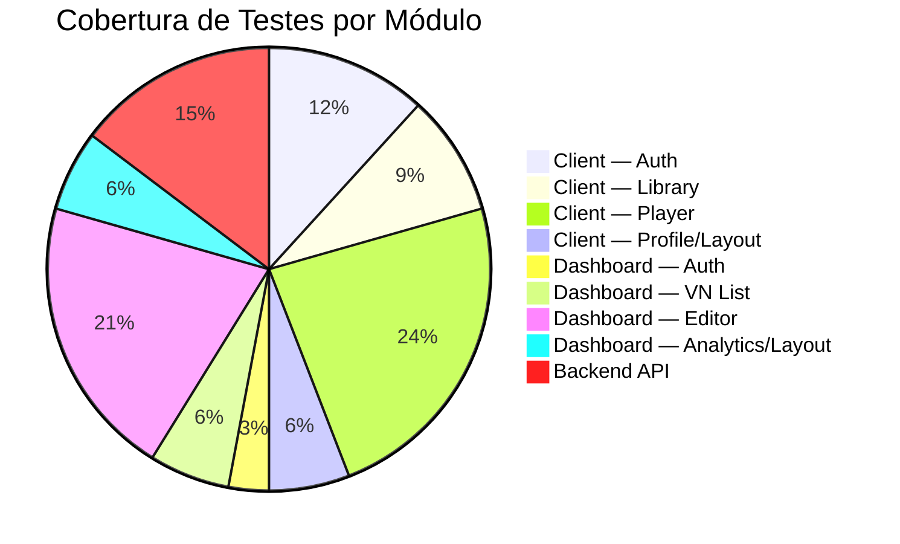

# Test Specification — Zan Visual Novel

**Versão:** 1.0  
**Data:** 2026-07-25  
**Status:** Draft  
**Autor:** Software Engineer  
**Padrão:** IEEE 829 (adaptado)  
**Ferramenta de Execução:** task-browser (GitHub Copilot browser agent)

---

## 1. Introdução

### 1.1 Propósito

Este documento especifica o plano de testes de regressão completa para a plataforma **Zan Visual Novel**, abrangendo todos os módulos implementados até a data: Client (Player), Dashboard (Creator Studio), Backend API e pacotes compartilhados. Os testes serão executados pelo agente `task-browser` do GitHub Copilot, que utiliza o navegador integrado do VS Code para interagir com as aplicações em execução.

### 1.2 Escopo

| Módulo                     | URL Base                | Tipo de Teste     |
| -------------------------- | ----------------------- | ----------------- |
| Client (Player)            | `http://localhost:5173` | E2E (navegador)   |
| Dashboard (Creator Studio) | `http://localhost:5174` | E2E (navegador)   |
| Backend API                | `http://localhost:3001` | Integração (HTTP) |

### 1.3 Referências

- [SRS — Software Requirements Specification](../requirements/srs.md)
- [Handoff — Pipeline de Desenvolvimento](../handoff.md)
- [browser.agent.md](../../agents/browser.agent.md)
- [Roadmap](../roadmap.md)

### 1.4 Definições

| Termo               | Definição                                                                    |
| ------------------- | ---------------------------------------------------------------------------- |
| **Smoke Test**      | Verificação rápida de que funcionalidades críticas não estão quebradas       |
| **Regression Test** | Verificação completa de que funcionalidades existentes continuam funcionando |
| **E2E**             | End-to-End — teste que simula o fluxo completo do usuário real               |
| **task-browser**    | Agente do Copilot especializado em navegação e interação web                 |
| **Test Data Seed**  | Conjunto de dados pré-definidos para ambiente de teste reproduzível          |

---

## 2. Matriz de Rastreabilidade

### 2.1 Requisitos × Casos de Teste

| Requisito   | Descrição                               | Caso de Teste                   |
| ----------- | --------------------------------------- | ------------------------------- |
| RF-AUTH-001 | Registro de usuário                     | TC-AUTH-001                     |
| RF-AUTH-002 | Login com email/senha                   | TC-AUTH-002, TC-AUTH-003        |
| RF-AUTH-003 | Login social (Google/GitHub)            | TC-AUTH-004                     |
| RF-CL-001   | Biblioteca de VNs — listagem            | TC-CL-001, TC-CL-002            |
| RF-CL-002   | Biblioteca — busca/filtro               | TC-CL-003                       |
| RF-CL-003   | Player — renderização de cena           | TC-CL-004, TC-CL-005            |
| RF-CL-004   | Player — sistema de escolhas            | TC-CL-006                       |
| RF-CL-005   | Player — saves (quick, slot, load)      | TC-CL-007, TC-CL-008, TC-CL-009 |
| RF-CL-006   | Player — auto-save                      | TC-CL-010                       |
| RF-CL-007   | Player — IA narrativa (LLM)             | TC-CL-011                       |
| RF-CL-008   | Perfil do usuário                       | TC-CL-012                       |
| RF-CL-009   | Layout — navegação e créditos           | TC-CL-013                       |
| RF-DS-001   | Dashboard — login                       | TC-DS-001                       |
| RF-DS-002   | Lista de VNs do criador                 | TC-DS-002, TC-DS-003            |
| RF-DS-003   | Criar nova VN                           | TC-DS-004                       |
| RF-DS-004   | Editor — metadados (título, sinopse)    | TC-DS-005                       |
| RF-DS-005   | Editor — capítulos (adicionar, deletar) | TC-DS-006, TC-DS-007            |
| RF-DS-006   | Editor — cenas (adicionar, editar)      | TC-DS-008, TC-DS-009            |
| RF-DS-007   | Editor — escolhas (adicionar)           | TC-DS-010                       |
| RF-DS-008   | Publicar VN                             | TC-DS-011                       |
| RF-DS-009   | Analytics (placeholder)                 | TC-DS-012                       |
| RF-DS-010   | Layout — drawer de navegação            | TC-DS-013                       |
| RF-API-001  | Health check                            | TC-API-001                      |
| RF-API-002  | CRUD de VNs                             | TC-API-002                      |
| RF-API-003  | CRUD de saves                           | TC-API-003                      |
| RF-API-004  | Sistema de créditos                     | TC-API-004                      |
| RF-API-005  | LLM generate (cloud fallback)           | TC-API-005                      |

### 2.2 Cobertura por Módulo



---

## 3. Pré-condições para Execução

### 3.1 Ambiente

- [x] **Client** rodando em `http://localhost:5173`
- [x] **Dashboard** rodando em `http://localhost:5174`
- [ ] **Backend API** rodando em `http://localhost:3001`
- [ ] **PostgreSQL** acessível com schema migrado
- [ ] **Redis** rodando para sessões

### 3.2 Dados de Teste (Seed)

Ver [Test Data Seed Specification](./test-data-seed.md) para o conjunto completo de dados. Resumo:

| Recurso         | Quantidade       | Descrição                               |
| --------------- | ---------------- | --------------------------------------- |
| Usuário Jogador | 1                | `jogador@teste.com` / `Teste123!`       |
| Usuário Criador | 1                | `criador@teste.com` / `Teste123!`       |
| VNs Publicadas  | 3                | Diversos gêneros, com capítulos e cenas |
| VNs Rascunho    | 2                | Para teste de dashboard                 |
| Capítulos       | 2-3 por VN       | Com cenas e escolhas                    |
| Cenas           | 3-5 por capítulo | Narração, diálogo, escolhas             |
| Saves           | 2                | Dois slots preenchidos para o jogador   |
| Créditos        | 50               | Saldo inicial do jogador                |

### 3.3 Credenciais de Teste

| Perfil  | Email               | Senha       | Role    |
| ------- | ------------------- | ----------- | ------- |
| Jogador | `jogador@teste.com` | `Teste123!` | player  |
| Criador | `criador@teste.com` | `Teste123!` | creator |

---

## 4. Casos de Teste

### 4.1 Client — Autenticação

#### TC-AUTH-001: Registro de novo usuário

| Campo                  | Valor                                                                                                                                                                                                                      |
| ---------------------- | -------------------------------------------------------------------------------------------------------------------------------------------------------------------------------------------------------------------------- |
| **Severidade**         | Critical                                                                                                                                                                                                                   |
| **Pré-condição**       | Usuário não autenticado, na página `/login`                                                                                                                                                                                |
| **Procedimento**       | 1. Acessar `http://localhost:5173/login`<br>2. Clicar em "Não tem conta? Criar"<br>3. Preencher Nome: `Novo Jogador`<br>4. Preencher Email: `novo@teste.com`<br>5. Preencher Senha: `Teste123!`<br>6. Clicar "Criar Conta" |
| **Resultado Esperado** | Redirecionado para `/library`. AppBar mostra nome do usuário e saldo de créditos. Token salvo no localStorage.                                                                                                             |
| **Resultado Obtido**   |                                                                                                                                                                                                                            |
| **Status**             | ⬜ Não executado                                                                                                                                                                                                           |

#### TC-AUTH-002: Login com credenciais válidas (Client)

| Campo                  | Valor                                                                                                                                        |
| ---------------------- | -------------------------------------------------------------------------------------------------------------------------------------------- |
| **Severidade**         | Critical                                                                                                                                     |
| **Pré-condição**       | Usuário `jogador@teste.com` existe no banco                                                                                                  |
| **Procedimento**       | 1. Acessar `http://localhost:5173/login`<br>2. Preencher Email: `jogador@teste.com`<br>3. Preencher Senha: `Teste123!`<br>4. Clicar "Entrar" |
| **Resultado Esperado** | Redirecionado para `/library`. AppBar mostra "jogador@teste.com" (ou displayName). Créditos visíveis.                                        |
| **Resultado Obtido**   |                                                                                                                                              |
| **Status**             | ⬜ Não executado                                                                                                                             |

#### TC-AUTH-003: Login com credenciais inválidas

| Campo                  | Valor                                                                                          |
| ---------------------- | ---------------------------------------------------------------------------------------------- |
| **Severidade**         | High                                                                                           |
| **Pré-condição**       | Página `/login`                                                                                |
| **Procedimento**       | 1. Preencher Email: `invalido@teste.com`<br>2. Preencher Senha: `errada`<br>3. Clicar "Entrar" |
| **Resultado Esperado** | Mensagem de erro exibida (vermelha). Permanece na página `/login`.                             |
| **Resultado Obtido**   |                                                                                                |
| **Status**             | ⬜ Não executado                                                                               |

#### TC-AUTH-004: Logout

| Campo                  | Valor                                                                                                                                                |
| ---------------------- | ---------------------------------------------------------------------------------------------------------------------------------------------------- |
| **Severidade**         | High                                                                                                                                                 |
| **Pré-condição**       | Usuário autenticado em qualquer página do client                                                                                                     |
| **Procedimento**       | 1. Clicar no botão "Sair" na AppBar<br>2. Verificar estado                                                                                           |
| **Resultado Esperado** | Usuário deslogado. AppBar mostra "Entrar". Tokens removidos do localStorage. Redirecionado para `/login` ou permanece na página sem dados sensíveis. |
| **Resultado Obtido**   |                                                                                                                                                      |
| **Status**             | ⬜ Não executado                                                                                                                                     |

---

### 4.2 Client — Biblioteca

#### TC-CL-001: Listagem de VNs publicadas

| Campo                  | Valor                                                                                                        |
| ---------------------- | ------------------------------------------------------------------------------------------------------------ |
| **Severidade**         | Critical                                                                                                     |
| **Pré-condição**       | Pelo menos 3 VNs publicadas no banco. Usuário autenticado ou não.                                            |
| **Procedimento**       | 1. Acessar `http://localhost:5173/library`<br>2. Observar cards de VN                                        |
| **Resultado Esperado** | Grid de VNCard exibido. Cada card mostra: imagem de capa, título, sinopse (ou preview). Cards são clicáveis. |
| **Resultado Obtido**   |                                                                                                              |
| **Status**             | ⬜ Não executado                                                                                             |

#### TC-CL-002: Estado vazio da biblioteca

| Campo                  | Valor                                                     |
| ---------------------- | --------------------------------------------------------- |
| **Severidade**         | Medium                                                    |
| **Pré-condição**       | Nenhuma VN publicada (ou busca sem resultados)            |
| **Procedimento**       | 1. Acessar `/library`<br>2. Observar estado               |
| **Resultado Esperado** | Mensagem "Nenhuma visual novel encontrada." centralizada. |
| **Resultado Obtido**   |                                                           |
| **Status**             | ⬜ Não executado                                          |

#### TC-CL-003: Busca/filtro na biblioteca

| Campo                  | Valor                                                                                  |
| ---------------------- | -------------------------------------------------------------------------------------- |
| **Severidade**         | High                                                                                   |
| **Pré-condição**       | VNs publicadas com títulos variados                                                    |
| **Procedimento**       | 1. Digitar termo de busca no campo "Buscar visual novels..."<br>2. Verificar filtragem |
| **Resultado Esperado** | Cards filtrados em tempo real pelo título e sinopse. Case-insensitive.                 |
| **Resultado Obtido**   |                                                                                        |
| **Status**             | ⬜ Não executado                                                                       |

---

### 4.3 Client — Player de VN

#### TC-CL-004: Carregar e iniciar uma VN

| Campo                  | Valor                                                                                                                                               |
| ---------------------- | --------------------------------------------------------------------------------------------------------------------------------------------------- |
| **Severidade**         | Critical                                                                                                                                            |
| **Pré-condição**       | VN `a-primeira-escolha` publicada com pelo menos 1 capítulo e 1 cena                                                                                |
| **Procedimento**       | 1. Na biblioteca, clicar em um VNCard<br>2. Aguardar carregamento                                                                                   |
| **Resultado Esperado** | Navega para `/play/:vnId`. Spinner durante carregamento. Cena renderizada com conteúdo de texto. Top bar visível com título da VN e botões de ação. |
| **Resultado Obtido**   |                                                                                                                                                     |
| **Status**             | ⬜ Não executado                                                                                                                                    |

#### TC-CL-005: Renderização de tipos de cena

| Campo                  | Valor                                                                                                                                                    |
| ---------------------- | -------------------------------------------------------------------------------------------------------------------------------------------------------- |
| **Severidade**         | High                                                                                                                                                     |
| **Pré-condição**       | VN carregada com cenas de tipos: `narration`, `dialogue`, `thought`                                                                                      |
| **Procedimento**       | 1. Navegar por cenas de diferentes tipos<br>2. Observar renderização                                                                                     |
| **Resultado Esperado** | Blocos de narração renderizados como texto normal. Diálogos mostram nome do speaker em destaque. Pensamentos renderizados em itálico ou estilo distinto. |
| **Resultado Obtido**   |                                                                                                                                                          |
| **Status**             | ⬜ Não executado                                                                                                                                         |

#### TC-CL-006: Fazer uma escolha e navegar

| Campo                  | Valor                                                                                                              |
| ---------------------- | ------------------------------------------------------------------------------------------------------------------ |
| **Severidade**         | Critical                                                                                                           |
| **Pré-condição**       | Cena atual possui choices (escolhas) definidas                                                                     |
| **Procedimento**       | 1. Observar painel de escolhas (ChoicePanel)<br>2. Clicar em uma das opções<br>3. Verificar transição              |
| **Resultado Esperado** | ChoicePanel exibe opções como botões. Ao clicar, engine navega para a cena alvo da escolha. Nova cena renderizada. |
| **Resultado Obtido**   |                                                                                                                    |
| **Status**             | ⬜ Não executado                                                                                                   |

#### TC-CL-007: Quick Save (salvar rápido)

| Campo                  | Valor                                                                    |
| ---------------------- | ------------------------------------------------------------------------ |
| **Severidade**         | High                                                                     |
| **Pré-condição**       | VN carregada, cena atual renderizada                                     |
| **Procedimento**       | 1. Clicar no ícone de Save (disquete) na top bar<br>2. Observar feedback |
| **Resultado Esperado** | Toast "Progresso salvo!" aparece. Save é persistido no slot 1.           |
| **Resultado Obtido**   |                                                                          |
| **Status**             | ⬜ Não executado                                                         |

#### TC-CL-008: Salvar em slot específico

| Campo                  | Valor                                                                                                 |
| ---------------------- | ----------------------------------------------------------------------------------------------------- |
| **Severidade**         | High                                                                                                  |
| **Pré-condição**       | VN carregada, drawer de saves aberto                                                                  |
| **Procedimento**       | 1. Clicar no ícone de Saves (pasta)<br>2. Selecionar slot vazio (ex: slot 3)<br>3. Clicar para salvar |
| **Resultado Esperado** | Drawer abre listando slots. Toast "Salvo no slot X!". Slot preenchido aparece na lista.               |
| **Resultado Obtido**   |                                                                                                       |
| **Status**             | ⬜ Não executado                                                                                      |

#### TC-CL-009: Carregar um save

| Campo                  | Valor                                                                                    |
| ---------------------- | ---------------------------------------------------------------------------------------- |
| **Severidade**         | Critical                                                                                 |
| **Pré-condição**       | Save existe no slot 1 para esta VN                                                       |
| **Procedimento**       | 1. Abrir drawer de saves<br>2. Clicar em um save existente (ex: "Auto Save" no slot 1)   |
| **Resultado Esperado** | Engine carrega o estado do save. Cena restaurada. Toast "Save carregado!". Drawer fecha. |
| **Resultado Obtido**   |                                                                                          |
| **Status**             | ⬜ Não executado                                                                         |

#### TC-CL-010: Auto-save (60 segundos)

| Campo                  | Valor                                                                                                                         |
| ---------------------- | ----------------------------------------------------------------------------------------------------------------------------- |
| **Severidade**         | Medium                                                                                                                        |
| **Pré-condição**       | VN carregada, cena atual diferente do último save                                                                             |
| **Procedimento**       | 1. Jogar por mais de 60 segundos sem salvar manualmente<br>2. Aguardar trigger do auto-save<br>3. Verificar saves disponíveis |
| **Resultado Esperado** | Após ~60s, save automático é criado/atualizado no slot 1. Toast "Progresso salvo!" aparece periodicamente.                    |
| **Resultado Obtido**   |                                                                                                                               |
| **Status**             | ⬜ Não executado                                                                                                              |

#### TC-CL-011: Erro ao carregar VN inexistente

| Campo                  | Valor                                                                                                 |
| ---------------------- | ----------------------------------------------------------------------------------------------------- |
| **Severidade**         | Medium                                                                                                |
| **Pré-condição**       | Navegar para `/play/id-inexistente`                                                                   |
| **Procedimento**       | 1. Acessar `http://localhost:5173/play/uuid-invalido`<br>2. Observar tratamento de erro               |
| **Resultado Esperado** | Alert de erro: "Não foi possível carregar esta visual novel." Botão "Voltar à Biblioteca" disponível. |
| **Resultado Obtido**   |                                                                                                       |
| **Status**             | ⬜ Não executado                                                                                      |

---

### 4.4 Client — Perfil e Layout

#### TC-CL-012: Página de perfil

| Campo                  | Valor                                                                              |
| ---------------------- | ---------------------------------------------------------------------------------- |
| **Severidade**         | High                                                                               |
| **Pré-condição**       | Usuário autenticado                                                                |
| **Procedimento**       | 1. Navegar para `/profile`<br>2. Verificar informações exibidas                    |
| **Resultado Esperado** | Display name, email, saldo de créditos (valor numérico), botão "Comprar Créditos". |
| **Resultado Obtido**   |                                                                                    |
| **Status**             | ⬜ Não executado                                                                   |

#### TC-CL-013: Layout — elementos de navegação

| Campo                  | Valor                                                                                                     |
| ---------------------- | --------------------------------------------------------------------------------------------------------- |
| **Severidade**         | High                                                                                                      |
| **Pré-condição**       | Usuário autenticado em qualquer página do client                                                          |
| **Procedimento**       | 1. Observar AppBar<br>2. Verificar elementos                                                              |
| **Resultado Esperado** | Logo "Zan VN" clicável (→ library). Saldo de créditos visível. Nome do usuário (→ profile). Botão "Sair". |
| **Resultado Obtido**   |                                                                                                           |
| **Status**             | ⬜ Não executado                                                                                          |

---

### 4.5 Dashboard — Autenticação

#### TC-DS-001: Login no Creator Studio

| Campo                  | Valor                                                                                                                                        |
| ---------------------- | -------------------------------------------------------------------------------------------------------------------------------------------- |
| **Severidade**         | Critical                                                                                                                                     |
| **Pré-condição**       | Usuário `criador@teste.com` existe                                                                                                           |
| **Procedimento**       | 1. Acessar `http://localhost:5174/login`<br>2. Preencher Email: `criador@teste.com`<br>3. Preencher Senha: `Teste123!`<br>4. Clicar "Entrar" |
| **Resultado Esperado** | Redirecionado para `/studio`. Drawer lateral visível com "Minhas VNs" e "Analytics". AppBar mostra "Creator Studio".                         |
| **Resultado Obtido**   |                                                                                                                                              |
| **Status**             | ⬜ Não executado                                                                                                                             |

---

### 4.6 Dashboard — Lista de VNs

#### TC-DS-002: Listar VNs do criador

| Campo                  | Valor                                                                                                                       |
| ---------------------- | --------------------------------------------------------------------------------------------------------------------------- |
| **Severidade**         | Critical                                                                                                                    |
| **Pré-condição**       | Criador autenticado, possui 2 VNs (1 publicado, 1 rascunho)                                                                 |
| **Procedimento**       | 1. Acessar `/studio`<br>2. Observar cards                                                                                   |
| **Resultado Esperado** | Cards exibindo: título, número de capítulos, chip de status ("Publicado" verde / "Rascunho" cinza). Botão "Editar" em cada. |
| **Resultado Obtido**   |                                                                                                                             |
| **Status**             | ⬜ Não executado                                                                                                            |

#### TC-DS-003: Estado vazio — sem VNs

| Campo                  | Valor                                                                                               |
| ---------------------- | --------------------------------------------------------------------------------------------------- |
| **Severidade**         | Medium                                                                                              |
| **Pré-condição**       | Novo criador sem VNs                                                                                |
| **Procedimento**       | 1. Fazer login com criador sem VNs<br>2. Observar `/studio`                                         |
| **Resultado Esperado** | Mensagem orientando: "Você ainda não criou nenhuma visual novel. Clique em 'Nova VN' para começar!" |
| **Resultado Obtido**   |                                                                                                     |
| **Status**             | ⬜ Não executado                                                                                    |

#### TC-DS-004: Botão "Nova VN"

| Campo                  | Valor                                                                       |
| ---------------------- | --------------------------------------------------------------------------- |
| **Severidade**         | High                                                                        |
| **Pré-condição**       | Criador autenticado em `/studio`                                            |
| **Procedimento**       | 1. Clicar no botão "Nova VN"<br>2. Verificar navegação                      |
| **Resultado Esperado** | Navega para `/studio/new`. Editor abre com campos vazios (título, sinopse). |
| **Resultado Obtido**   |                                                                             |
| **Status**             | ⬜ Não executado                                                            |

---

### 4.7 Dashboard — Editor de VN

#### TC-DS-005: Editar metadados da VN (título, sinopse)

| Campo                  | Valor                                                                                    |
| ---------------------- | ---------------------------------------------------------------------------------------- |
| **Severidade**         | Critical                                                                                 |
| **Pré-condição**       | Editor aberto em VN existente (`/studio/:vnId`), aba "Detalhes"                          |
| **Procedimento**       | 1. Alterar título para "Nova Aventura Teste"<br>2. Alterar sinopse<br>3. Clicar "Salvar" |
| **Resultado Esperado** | Toast "Visual Novel salva!". Campos persistem após reload.                               |
| **Resultado Obtido**   |                                                                                          |
| **Status**             | ⬜ Não executado                                                                         |

#### TC-DS-006: Adicionar capítulo

| Campo                  | Valor                                                                                                              |
| ---------------------- | ------------------------------------------------------------------------------------------------------------------ |
| **Severidade**         | Critical                                                                                                           |
| **Pré-condição**       | Editor aberto, aba "Capítulos" selecionada                                                                         |
| **Procedimento**       | 1. Clicar em "Adicionar Capítulo" (ou ícone +)<br>2. Preencher título: "Capítulo Teste"<br>3. Confirmar no diálogo |
| **Resultado Esperado** | Diálogo abre com campo de título. Ao confirmar, capítulo aparece na lista. Toast "Capítulo adicionado!".           |
| **Resultado Obtido**   |                                                                                                                    |
| **Status**             | ⬜ Não executado                                                                                                   |

#### TC-DS-007: Deletar capítulo

| Campo                  | Valor                                                                                                |
| ---------------------- | ---------------------------------------------------------------------------------------------------- |
| **Severidade**         | High                                                                                                 |
| **Pré-condição**       | Editor com capítulo selecionado                                                                      |
| **Procedimento**       | 1. Clicar no ícone de deletar (lixeira) ao lado do capítulo                                          |
| **Resultado Esperado** | Capítulo removido da lista. Se era o selecionado, seleção limpa. Cenas associadas não mais visíveis. |
| **Resultado Obtido**   |                                                                                                      |
| **Status**             | ⬜ Não executado                                                                                     |

#### TC-DS-008: Adicionar cena

| Campo                  | Valor                                                                                |
| ---------------------- | ------------------------------------------------------------------------------------ |
| **Severidade**         | Critical                                                                             |
| **Pré-condição**       | Capítulo selecionado, aba "Cenas"                                                    |
| **Procedimento**       | 1. Clicar em adicionar cena<br>2. Verificar nova cena na lista                       |
| **Resultado Esperado** | Nova cena aparece com nome "Cena N". Cena é selecionada automaticamente para edição. |
| **Resultado Obtido**   |                                                                                      |
| **Status**             | ⬜ Não executado                                                                     |

#### TC-DS-009: Editar conteúdo da cena (text blocks)

| Campo                  | Valor                                                                                                      |
| ---------------------- | ---------------------------------------------------------------------------------------------------------- |
| **Severidade**         | Critical                                                                                                   |
| **Pré-condição**       | Cena selecionada para edição                                                                               |
| **Procedimento**       | 1. Selecionar tipo de bloco (narração/diálogo/pensamento)<br>2. Digitar texto<br>3. Adicionar bloco à cena |
| **Resultado Esperado** | Blocos de texto adicionados e exibidos na cena. Tipos renderizados com estilos distintos.                  |
| **Resultado Obtido**   |                                                                                                            |
| **Status**             | ⬜ Não executado                                                                                           |

#### TC-DS-010: Adicionar escolha (choice)

| Campo                  | Valor                                                                                         |
| ---------------------- | --------------------------------------------------------------------------------------------- |
| **Severidade**         | High                                                                                          |
| **Pré-condição**       | Cena selecionada, seção de escolhas visível                                                   |
| **Procedimento**       | 1. Digitar texto da escolha<br>2. Definir cena alvo (target scene ID)<br>3. Adicionar escolha |
| **Resultado Esperado** | Escolha aparece na lista de choices da cena. Texto e target visíveis.                         |
| **Resultado Obtido**   |                                                                                               |
| **Status**             | ⬜ Não executado                                                                              |

#### TC-DS-011: Publicar VN

| Campo                  | Valor                                                                                               |
| ---------------------- | --------------------------------------------------------------------------------------------------- |
| **Severidade**         | Critical                                                                                            |
| **Pré-condição**       | VN com pelo menos 1 capítulo e 1 cena, status atual "draft"                                         |
| **Procedimento**       | 1. No editor, clicar "Publicar"<br>2. Confirmar ação                                                |
| **Resultado Esperado** | Toast "Visual Novel publicada! 🎉". Status muda para "published". VN aparece na biblioteca pública. |
| **Resultado Obtido**   |                                                                                                     |
| **Status**             | ⬜ Não executado                                                                                    |

---

### 4.8 Dashboard — Analytics e Layout

#### TC-DS-012: Página de Analytics

| Campo                  | Valor                                                                                                     |
| ---------------------- | --------------------------------------------------------------------------------------------------------- |
| **Severidade**         | Low                                                                                                       |
| **Pré-condição**       | Criador autenticado                                                                                       |
| **Procedimento**       | 1. Navegar para `/analytics` via drawer<br>2. Observar conteúdo                                           |
| **Resultado Esperado** | Título "Analytics". Card de resumo com placeholder: "Métricas de consumo e créditos serão exibidas aqui." |
| **Resultado Obtido**   |                                                                                                           |
| **Status**             | ⬜ Não executado                                                                                          |

#### TC-DS-013: Layout — drawer de navegação

| Campo                  | Valor                                                                                                            |
| ---------------------- | ---------------------------------------------------------------------------------------------------------------- |
| **Severidade**         | High                                                                                                             |
| **Pré-condição**       | Criador autenticado                                                                                              |
| **Procedimento**       | 1. Verificar drawer lateral<br>2. Clicar em "Minhas VNs"<br>3. Clicar em "Analytics"                             |
| **Resultado Esperado** | Drawer fixo à esquerda (240px). Links com ícones (MenuBook, BarChart). Navegação entre `/studio` e `/analytics`. |
| **Resultado Obtido**   |                                                                                                                  |
| **Status**             | ⬜ Não executado                                                                                                 |

---

### 4.9 Backend API

#### TC-API-001: Health Check

| Campo                  | Valor                                                 |
| ---------------------- | ----------------------------------------------------- |
| **Severidade**         | Critical                                              |
| **Endpoint**           | `GET http://localhost:3001/api/health`                |
| **Resultado Esperado** | Status 200. Body: `{"status":"ok","timestamp":"..."}` |
| **Resultado Obtido**   |                                                       |
| **Status**             | ⬜ Não executado                                      |

#### TC-API-002: CRUD de VNs

| Campo                  | Valor                                                                                                                                                                                           |
| ---------------------- | ----------------------------------------------------------------------------------------------------------------------------------------------------------------------------------------------- |
| **Severidade**         | Critical                                                                                                                                                                                        |
| **Endpoints**          | `GET /api/v1/vns`, `GET /api/v1/vns/:id`, `POST /api/v1/vns`, `PUT /api/v1/vns/:id`, `DELETE /api/v1/vns/:id`                                                                                   |
| **Procedimento**       | 1. Listar VNs publicadas (sem auth)<br>2. Listar VNs do criador (com auth)<br>3. Criar VN (com auth)<br>4. Atualizar VN<br>5. Buscar VN por ID (com chapters, scenes, choices)<br>6. Deletar VN |
| **Resultado Esperado** | CRUD completo funcional. Paginação correta. Dados aninhados (chapters, scenes, choices) retornados no GET by ID.                                                                                |
| **Resultado Obtido**   |                                                                                                                                                                                                 |
| **Status**             | ⬜ Não executado                                                                                                                                                                                |

#### TC-API-003: CRUD de Saves

| Campo                  | Valor                                                                                                        |
| ---------------------- | ------------------------------------------------------------------------------------------------------------ |
| **Severidade**         | High                                                                                                         |
| **Endpoints**          | `GET /api/v1/saves`, `POST /api/v1/saves`, `PUT /api/v1/saves/:id`, `DELETE /api/v1/saves/:id`               |
| **Procedimento**       | 1. Listar saves do usuário<br>2. Criar save no slot 2<br>3. Atualizar mesmo slot (upsert)<br>4. Deletar save |
| **Resultado Esperado** | Saves associados ao usuário autenticado. Upsert funciona (mesmo slot = update). Deleção funciona.            |
| **Resultado Obtido**   |                                                                                                              |
| **Status**             | ⬜ Não executado                                                                                             |

#### TC-API-004: Sistema de Créditos

| Campo                  | Valor                                                                                                                                                  |
| ---------------------- | ------------------------------------------------------------------------------------------------------------------------------------------------------ |
| **Severidade**         | High                                                                                                                                                   |
| **Endpoints**          | `GET /api/v1/credits/packages`, `POST /api/v1/credits/checkout`, `POST /api/v1/credits/spend`                                                          |
| **Procedimento**       | 1. Listar pacotes<br>2. Comprar pacote "Pacote Inicial" (100 créditos)<br>3. Verificar saldo<br>4. Gastar créditos<br>5. Verificar saldo atualizado    |
| **Resultado Esperado** | Pacotes listados corretamente. Saldo incrementado após compra. Saldo decrementado após gasto. Transações registradas. Saldo nunca negativo (validado). |
| **Resultado Obtido**   |                                                                                                                                                        |
| **Status**             | ⬜ Não executado                                                                                                                                       |

#### TC-API-005: LLM Generate (Cloud Fallback)

| Campo                  | Valor                                                                                         |
| ---------------------- | --------------------------------------------------------------------------------------------- |
| **Severidade**         | Medium                                                                                        |
| **Endpoint**           | `POST /api/v1/llm/generate`                                                                   |
| **Procedimento**       | 1. Enviar prompt com contexto de cena<br>2. Verificar resposta                                |
| **Resultado Esperado** | Status 200. Body contém `text` (placeholder ou resposta real), `modelUsed`, `isLocal: false`. |
| **Resultado Obtido**   |                                                                                               |
| **Status**             | ⬜ Não executado                                                                              |

---

## 5. Testes de Layout e Visual (task-browser skills)

Além dos testes funcionais, o `task-browser` pode executar análises de layout usando as skills complementares:

| Skill                     | Quando Usar                      | Casos Aplicáveis                                       |
| ------------------------- | -------------------------------- | ------------------------------------------------------ |
| `browser-layout-analysis` | Análise estrutural de páginas    | TC-CL-013, TC-DS-013, Verificação de responsividade    |
| `browser-visual-review`   | Comparação visual com referência | Consistência de design system, tipografia, espaçamento |

### 5.1 Verificações de Layout (Client)

| ID         | Verificação                                          | Página           |
| ---------- | ---------------------------------------------------- | ---------------- |
| TC-LAY-001 | AppBar sticky com blur background                    | Todas            |
| TC-LAY-002 | Container maxWidth="lg" centralizado                 | Library, Profile |
| TC-LAY-003 | Grid de VNCards responsivo (xs=12, sm=6, md=4, lg=3) | Library          |
| TC-LAY-004 | Player maxWidth=800px centralizado                   | Player           |
| TC-LAY-005 | Login page centralizado vertical e horizontalmente   | Login            |
| TC-LAY-006 | Font "Playfair Display" no título da VN no player    | Player           |

### 5.2 Verificações de Layout (Dashboard)

| ID         | Verificação                                          | Página  |
| ---------- | ---------------------------------------------------- | ------- |
| TC-LAY-007 | Drawer fixo com largura 240px                        | Todas   |
| TC-LAY-008 | AppBar fixa com zIndex=1201                          | Todas   |
| TC-LAY-009 | Tabs do editor (Detalhes, Capítulos, Cenas, Preview) | Editor  |
| TC-LAY-010 | Cards de VN com chip de status colorido              | VN List |

---

## 6. Fluxos End-to-End Completos

### 6.1 Fluxo do Jogador (Happy Path)

```
Registro → Login → Biblioteca → Selecionar VN → Ler Cena →
Fazer Escolha → Salvar → Sair → Login Novamente →
Carregar Save → Continuar Jogando
```

**Script task-browser:** Ver [task-browser-scripts.md#fluxo-jogador](./task-browser-scripts.md#fluxo-1-jogador-completo)

### 6.2 Fluxo do Criador (Happy Path)

```
Login → Minhas VNs → Nova VN → Preencher Detalhes → Salvar →
Adicionar Capítulo → Adicionar Cenas → Adicionar Escolhas →
Publicar → Verificar na Biblioteca Pública → Analytics
```

**Script task-browser:** Ver [task-browser-scripts.md#fluxo-criador](./task-browser-scripts.md#fluxo-2-criador-completo)

### 6.3 Fluxo de Créditos

```
Login → Perfil → Ver Saldo → Comprar Créditos →
Verificar Saldo Atualizado → Jogar VN Paga (gastar créditos)
```

**Script task-browser:** Ver [task-browser-scripts.md#fluxo-creditos](./task-browser-scripts.md#fluxo-3-creditos)

---

## 7. Critérios de Aceitação da Suíte de Testes

- [ ] Todos os casos Critical executados e passando (100%)
- [ ] Todos os casos High executados e passando (≥ 95%)
- [ ] Todos os fluxos E2E executados com sucesso
- [ ] Nenhuma regressão detectada em funcionalidade existente
- [ ] Relatório de execução preenchido com resultados
- [ ] Screenshots de evidência capturados para falhas

---

## 8. Apêndices

### 8.1 Ambiente de Teste

| Variável      | Valor                               |
| ------------- | ----------------------------------- |
| OS            | Linux                               |
| Navegador     | VS Code Built-in Browser (Chromium) |
| Node.js       | 20+                                 |
| Client URL    | `http://localhost:5173`             |
| Dashboard URL | `http://localhost:5174`             |
| API URL       | `http://localhost:3001`             |
| DB            | PostgreSQL 16                       |

### 8.2 Como Executar

```bash
# 1. Garantir que apps estão rodando
npm run dev

# 2. Seed o banco com dados de teste
npm run db:seed:test

# 3. Executar testes via task-browser
# Use o agent task-browser no Copilot Chat:
#   @task-browser execute os scripts em .github/artifacts/tests/task-browser-scripts.md

# 4. Para testes de API (via terminal):
curl http://localhost:3001/api/health
```

### 8.3 Relatório de Execução

Após cada execução, preencher:

| Data | Executor | Casos Executados | Passaram | Falharam | Observações |
| ---- | -------- | ---------------- | -------- | -------- | ----------- |
|      |          |                  |          |          |             |
