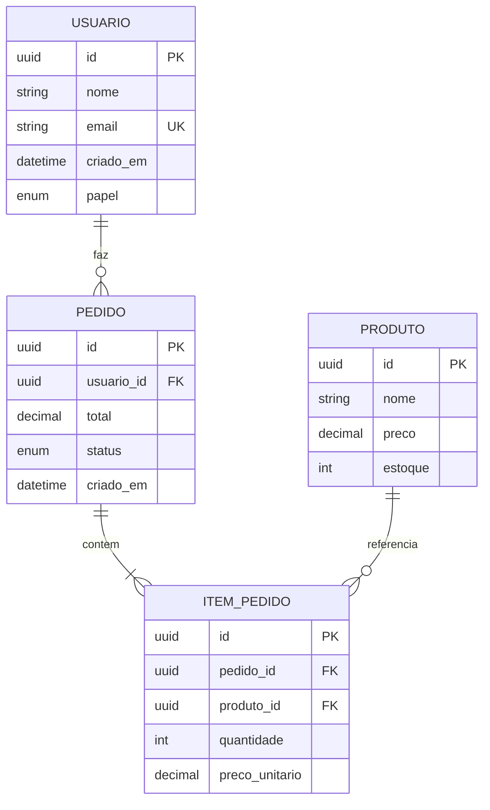
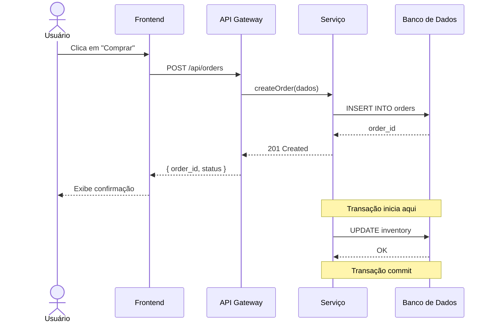
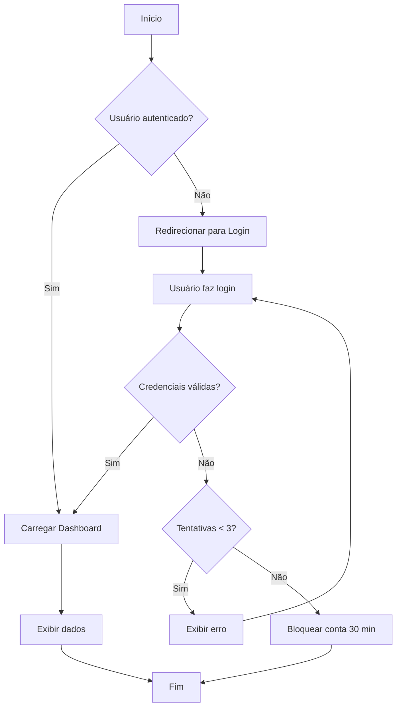
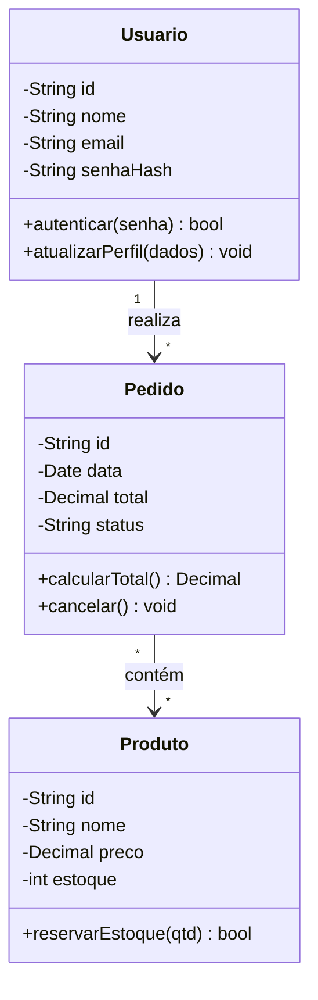
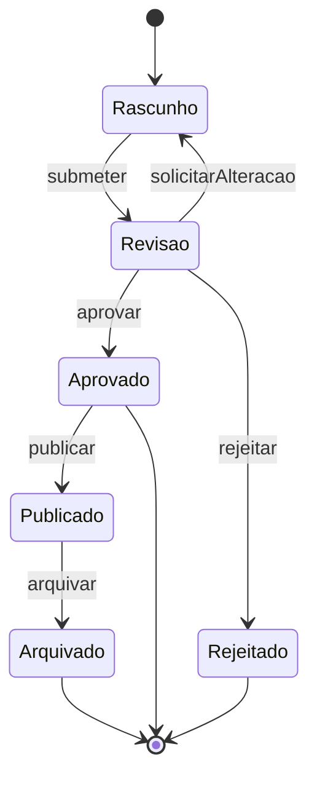
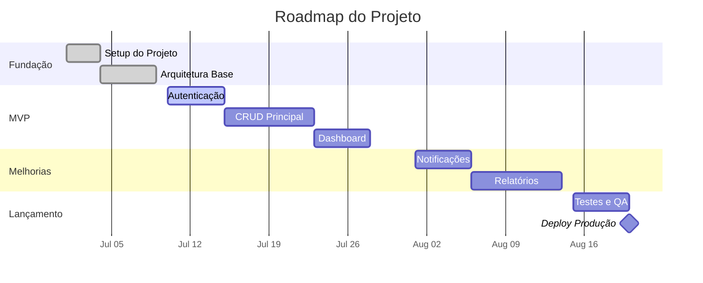
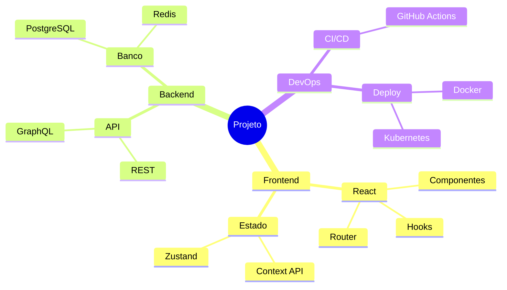
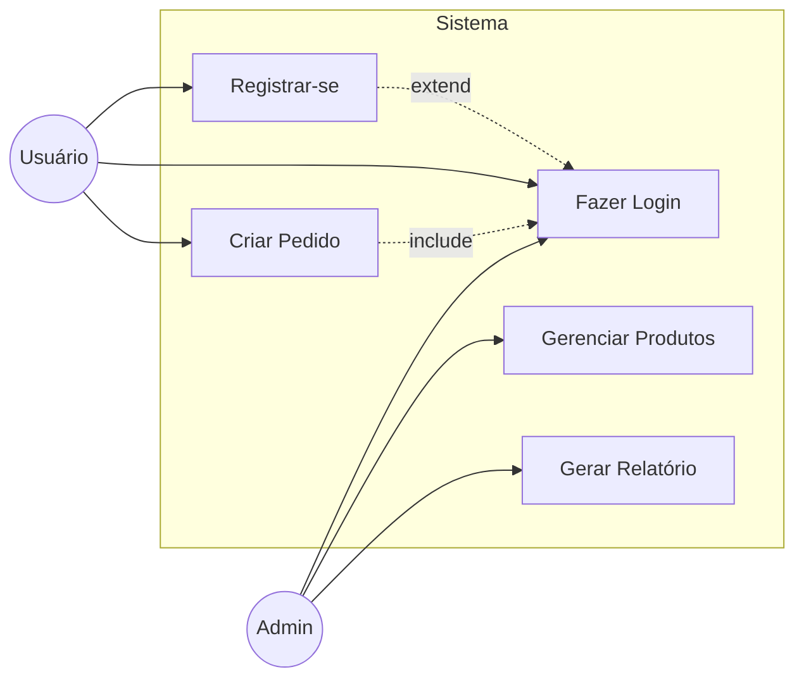

# Diagramming — Criação de Diagramas e Artefatos Visuais

Skill para criação de diagramas profissionais usando Mermaid. Cobre todos os tipos de diagramas relevantes para engenharia de software.

> **Nota técnica:** Use `activate_mermaid_diagram_tools` antes de criar diagramas. O fluxo é: consultar sintaxe → validar → preview.

---

## 1. Catálogo de Diagramas

```mermaid
mindmap
  root((Diagramas))
    Estrutura
      ERD
      Classes UML
      Componentes
      C4 Model
    Comportamento
      Sequência
      Atividade
      Estado
      Casos de Uso
    Fluxo
      Flowchart
      Data Flow
      BPMN simples
    Gestão
      Gantt
      Roadmap
      Timeline
      Mindmap
```

---

## 2. Diagrama Entidade-Relacionamento (ERD)

### Template



### Convenções:

- **PK**: Primary Key
- **FK**: Foreign Key
- **UK**: Unique Key
- Cardinalidade: `||--o{` (um-para-muitos), `}|--||` (muitos-para-um), `||--||` (um-para-um)
- Relacionamentos nomeados com `: descricao`

---

## 3. Diagrama de Sequência

### Template



### Convenções:

- `->>`: chamada síncrona
- `-->>`: resposta/retorno
- `actor`: usuário/papel externo
- `participant`: sistema/componente
- `Note over X,Y`: comentário explicativo
- `alt/else/end`: fluxos alternativos
- `loop/end`: repetição

---

## 4. Fluxograma (Flowchart)

### Template



### Convenções:

- `[]`: processo/ação (retângulo)
- `{}`: decisão/condição (losango)
- `()``: início/fim (cápsula)
- `[()]`: sub-rotina
- Direções: TD (top-down), LR (left-right), BT, RL

---

## 5. Diagrama de Classes (UML)

### Template



### Convenções:

- `+`: público, `-`: privado, `#`: protegido
- `<<interface>>`, `<<abstract>>`: estereótipos
- Herança: `ClasseFilha --|> ClassePai`
- Implementação: `Classe ..|> Interface`
- Composição: `*--`, Agregação: `o--`

---

## 6. Diagrama de Estados

### Template



---

## 7. Gráfico de Gantt / Roadmap

### Template



---

## 8. Mapa Mental

### Template



---

## 9. Diagrama de Caso de Uso

### Template



---

## 10. Procedimento

### Ao criar diagramas:

1. **Ativar ferramentas** — Chame `activate_mermaid_diagram_tools` primeiro
2. **Identificar o tipo** — Qual diagrama melhor representa o conceito?
3. **Consultar sintaxe** — Use `mermaid-diagram-validator` para validar
4. **Criar** — Escreva o código Mermaid
5. **Validar** — Execute o validador
6. **Preview** — Use `mermaid-diagram-preview` para visualizar
7. **Salvar** — Salve o código `.mmd` e/ou exporte a imagem em `.github/artifacts/diagrams/`

### Regras:

- SEMPRE use `activate_mermaid_diagram_tools` antes de criar diagramas
- SEMPRE valide a sintaxe com o validador antes do preview
- SEMPRE salve os arquivos `.mmd` (código fonte) em `.github/artifacts/diagrams/`
- Prefira diagramas com direção top-down (TD) para fluxos
- Use notas (`Note`) para adicionar contexto quando necessário
- Mantenha diagramas focados — um conceito por diagrama
- Use `vscode_askQuestions` se precisar decidir qual tipo de diagrama usar
