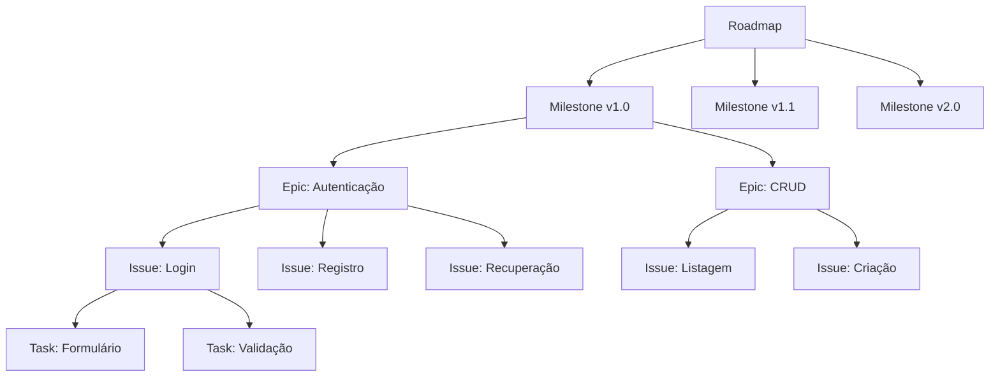

# Project Management — Gestão de Projetos de Software

Skill para gestão completa de projetos de software usando GitHub Projects, Issues, Milestones e métricas de engenharia.

---

## 1. Estrutura de Gestão no GitHub



### Hierarquia:
| Nível | Artefato GitHub | Propósito | Duração Típica |
|-------|----------------|-----------|----------------|
| **Estratégia** | Repository Description + README | Visão de longo prazo | 6-12 meses |
| **Roadmap** | GitHub Projects (Board) | Planejamento tático | 3-6 meses |
| **Release** | Milestone | Agrupamento de funcionalidades | 2-4 semanas |
| **Epic** | Issue com label `epic` | Funcionalidade grande | 1-2 semanas |
| **Feature** | Issue | Funcionalidade específica | 1-5 dias |
| **Task** | Task List em Issue | Subtarefa atômica | 1-8 horas |

---

## 2. Criação de Milestones

### Template

```markdown
# Milestone: [Nome da Versão] — vX.Y.Z

**Data Alvo:** YYYY-MM-DD
**Status:** Open | In Progress | Closed
**Descrição:** [O que esta release entrega de valor]

## Objetivos
- [Objetivo de negócio 1]
- [Objetivo técnico 1]

## Escopo
| Issue | Título | Prioridade | Status | Responsável |
|-------|--------|------------|--------|-------------|
| #42 | Login com OAuth | Must | Done | @dev1 |
| #43 | Dashboard | Should | In Progress | @dev2 |

## Fora do Escopo
- [Funcionalidade adiada para próxima release]

## Definition of Done
- [ ] Código revisado (PR aprovado)
- [ ] Testes passando (coverage > 80%)
- [ ] Documentação atualizada
- [ ] Deploy em staging validado
```

---

## 3. Criação de Roadmap

### Template

```markdown
# Roadmap: [Nome do Projeto] — 2026

## Q3 2026 — Fundação
**Tema:** Estabelecer a base técnica e lançar MVP

### Julho
- [ ] Setup do projeto, CI/CD, ambiente dev (#1)
- [ ] Arquitetura base e padrões (#2)
- [ ] Sistema de autenticação (#3)

### Agosto
- [ ] CRUD principal (#4)
- [ ] Dashboard administrativo (#5)
- [ ] MVP — lançamento interno (#10)

### Setembro
- [ ] Testes com usuários (#11)
- [ ] Correções do feedback (#12-20)
- [ ] Preparação para beta público (#21)

## Q4 2026 — Crescimento
**Tema:** Expandir funcionalidades e escalar

### Outubro
- [ ] Lançamento beta público 🚀
- [ ] Sistema de notificações (#22)
- [ ] Relatórios e analytics (#23)

### Novembro
- [ ] API pública (#24)
- [ ] Integrações externas (#25)
- [ ] Otimizações de performance (#26)

### Dezembro
- [ ] Lançamento v1.0 🎉
- [ ] Documentação completa (#27)
- [ ] Planejamento 2027 (#28)

---

## Métricas de Sucesso por Trimestre
| Métrica | Q3 Alvo | Q4 Alvo |
|---------|---------|---------|
| Usuários ativos | 100 (interno) | 1,000 |
| Issues completadas | 20 | 30 |
| Cobertura de testes | 80% | 85% |
| Uptime | 99.5% | 99.9% |
```

---

## 4. Templates de Issue

### Bug Report (`fix:`)

```markdown
### Descrição do Bug
[Descrição clara e concisa]

### Passos para Reproduzir
1. [Passo 1]
2. [Passo 2]
3. [Passo 3]

### Comportamento Esperado
[O que deveria acontecer]

### Comportamento Atual
[O que está acontecendo]

### Ambiente
- SO: [ex: Windows 11]
- Navegador: [ex: Chrome 120]
- Versão: [ex: v1.2.3]

### Screenshots/Logs
[Se aplicável]

### Severidade
- [ ] Crítico — sistema indisponível
- [ ] Alto — funcionalidade principal quebrada
- [ ] Médio — funcionalidade parcialmente afetada
- [ ] Baixo — cosmético ou borda
```

### Feature Request (`feat:`)

```markdown
### Motivação
[Por que esta funcionalidade é necessária? Qual problema resolve?]

### Descrição
[O que será implementado — seja específico]

### Critérios de Aceitação
- [ ] [Critério 1]
- [ ] [Critério 2]
- [ ] [Critério 3]

### Design & UX
[Links para mockups, wireframes, ou inspirações]

### Definição de Pronto (DoD)
- [ ] Implementado seguindo padrões do projeto
- [ ] Cobertura de testes ≥ 80%
- [ ] Documentação atualizada
- [ ] Revisão de código aprovada
```

### Improvement (`improve:`)

```markdown
### Situação Atual
[Como está hoje — o problema]

### Proposta de Melhoria
[O que será mudado — a solução]

### Benefícios Esperados
- [Benefício 1]
- [Benefício 2]

### Impacto
- **Componentes afetados:** [lista]
- **Risco:** [Baixo | Médio | Alto]
- **Esforço estimado:** [Pequeno | Médio | Grande]
```

---

## 5. Labels e Organização

### Sistema de Labels Recomendado

| Categoria | Label | Cor | Descrição |
|-----------|-------|-----|-----------|
| **Tipo** | `bug` | `#d73a4a` | Algo está quebrado |
| | `feature` | `#0075ca` | Nova funcionalidade |
| | `improvement` | `#0e8a16` | Melhoria em existente |
| | `docs` | `#bfdadc` | Documentação |
| | `tech-debt` | `#d4c5f9` | Dívida técnica |
| **Prioridade** | `priority/critical` | `#b60205` | Bloqueante, urgente |
| | `priority/high` | `#d93f0b` | Importante, próximo |
| | `priority/medium` | `#fbca04` | Normal |
| | `priority/low` | `#0e8a16` | Quando der |
| **Estado** | `status/blocked` | `#000000` | Bloqueado |
| | `status/needs-review` | `#5319e7` | Aguardando revisão |
| | `status/in-progress` | `#fbca04` | Em andamento |
| **Tamanho** | `size/xs` | `#0e8a16` | < 2 horas |
| | `size/s` | `#0e8a16` | 2-8 horas |
| | `size/m` | `#fbca04` | 1-3 dias |
| | `size/l` | `#d93f0b` | 3-5 dias |
| | `size/xl` | `#b60205` | > 1 semana (dividir!) |

---

## 6. Métricas de Engenharia

### DORA Metrics (DevOps Research and Assessment)

| Métrica | Descrição | Elite | High | Medium | Low |
|---------|-----------|-------|------|--------|-----|
| **Deployment Frequency** | Frequência de deploys | On-demand | 1/day-1/week | 1/week-1/month | < 1/month |
| **Lead Time for Changes** | Tempo commit→produção | < 1h | 1h-1day | 1day-1week | > 1week |
| **Change Failure Rate** | % deploys com falha | < 5% | 5-10% | 10-15% | > 15% |
| **Time to Restore** | Tempo para recuperar | < 1h | < 1day | < 1week | > 1week |

### Métricas de Processo

| Métrica | Como Calcular | Frequência |
|---------|---------------|------------|
| **Velocity** | Story points completados / sprint | Por sprint |
| **Cycle Time** | Tempo issue aberta → fechada | Por issue |
| **Throughput** | Issues fechadas / semana | Semanal |
| **Burndown** | Trabalho restante vs. tempo | Diário (sprint) |
| **Bug Rate** | Bugs abertos / features entregues | Por release |
| **Code Review Time** | Tempo PR aberto → merge | Por PR |

---

## 7. Automação com GitHub Projects

### Workflow Sugerido (Kanban)

```
Backlog → Ready → In Progress → In Review → Done
```

### Automações:
- Nova issue → `Backlog`
- Issue assignada → `In Progress`
- PR aberto → `In Review`
- PR merged → `Done`
- Issue fechada sem PR → `Done`

---

## 8. Procedimento

### Ao gerenciar o projeto:

1. **Avaliar estado atual** — Revisar issues abertas, milestones, roadmap
2. **Identificar ação** — Criar, atualizar, priorizar, ou reportar
3. **Usar templates** — Templates de issue/milestone/roadmap acima
4. **Manter rastreabilidade** — Issues ligadas a milestones, PRs com `Closes #N`
5. **Reportar** — Gerar resumo de status quando solicitado

### Comandos Comuns via GitHub MCP:

| Ação | Ferramenta |
|------|-----------|
| Listar issues | `#tool:github/issues` |
| Criar issue | `#tool:github/create_issue` |
| Atualizar issue | `#tool:github/update_issue` |
| Criar milestone | Via GitHub UI + link na issue |
| Listar PRs | `#tool:github/pull_requests` |
| Criar PR | `#tool:github/create_pull_request` |
| Adicionar labels | `#tool:github/update_issue` com labels |

### Regras:
- SEMPRE use `vscode_askQuestions` para interagir com o usuário
- SEMPRE use `manage_todo_list` para estruturar as etapas
- SEMPRE vincule issues a milestones para rastreabilidade
- SEMPRE use o sistema de labels para organização
- Use a skill `diagramming` para criar gráficos de Gantt/roadmap visual
- Use a skill `requirements-engineering` se precisar elicitar requisitos antes de criar issues
