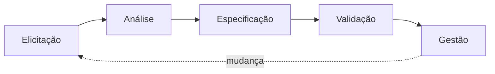

# Requirements Engineering — Engenharia de Requisitos

Skill de conhecimento e processo para engenharia de requisitos profissional. Cobre o ciclo completo: elicitação → análise → especificação → validação → gestão.

---

## 1. Processo de Engenharia de Requisitos



### 1.1 Elicitação — Técnicas

| Técnica | Quando usar | Entregável |
|---------|-------------|------------|
| **Entrevistas** | Stakeholders disponíveis, necessidade de profundidade | Notas de entrevista |
| **Questionários** | Muitos stakeholders, dispersão geográfica | Respostas tabuladas |
| **Observação** | Processos existentes, entender fluxo real | Relatório de observação |
| **Brainstorming** | Fase inicial, exploração de ideias | Mapa mental, lista de ideias |
| **Análise de documentos** | Sistemas legados, regulamentações | Resumo de achados |
| **Prototipação** | Requisitos incertos, validar com usuário | Protótipo (baixa/alta fidelidade) |
| **Workshop facilitado** | Múltiplos stakeholders, alinhamento | Acordos documentados |

### 1.2 Análise — Classificação

**Requisitos Funcionais (RF):**
O que o sistema DEVE fazer. Comportamentos, funcionalidades, regras de negócio.

- Formato: `RF-XXX: O sistema deve [verbo] [funcionalidade] [contexto/restrição]`
- Exemplo: `RF-001: O sistema deve permitir que o usuário faça login com email e senha`

**Requisitos Não-Funcionais (RNF):**
COMO o sistema deve ser. Qualidades, restrições, atributos.

| Categoria | Exemplos |
|-----------|----------|
| **Performance** | Tempo de resposta < 200ms, suportar 10k usuários simultâneos |
| **Segurança** | Criptografia AES-256, autenticação OAuth 2.0, RBAC |
| **Usabilidade** | Acessibilidade WCAG 2.1 AA, taxa de erro < 5% |
| **Confiabilidade** | Uptime 99.9%, MTTR < 1h, backup diário |
| **Manutenibilidade** | Cobertura de testes > 80%, documentação atualizada |
| **Portabilidade** | Compatível com Chrome, Firefox, Safari, Edge |

**Regras de Negócio (RN):**
Políticas, condições, restrições do domínio.

- Formato: `RN-XXX: [condição] → [ação/consequência]`
- Exemplo: `RN-001: Se o usuário errar a senha 3 vezes, a conta é bloqueada por 30 minutos`

### 1.3 Especificação — Formatos

#### User Story (Ágil)

```
Como [persona],
Quero [funcionalidade],
Para [benefício/objetivo].

Critérios de Aceitação:
- [ ] Dado [contexto], Quando [ação], Então [resultado]
- [ ] Dado [contexto], Quando [ação], Então [resultado]
```

#### Caso de Uso (Detalhado)

```
Nome: [Nome do caso de uso]
Ator Primário: [Quem inicia]
Pré-condições: [O que deve ser verdade antes]
Fluxo Principal:
  1. [Ator] faz [ação]
  2. [Sistema] responde com [comportamento]
  3. ...
Fluxos Alternativos:
  A1: [Condição] → [comportamento alternativo]
Pós-condições: [O que é verdade depois]
```

#### Especificação IEEE 830 (SRS)

Estrutura completa de um Software Requirements Specification:

1. Introdução (propósito, escopo, definições, referências)
2. Descrição Geral (perspectiva do produto, funções, usuários, restrições)
3. Requisitos Específicos (funcionais, não-funcionais, interfaces)
4. Apêndices (glossário, modelos de dados, diagramas)

### 1.4 Validação — Checklist

- [ ] **Completude**: Todos os cenários cobertos?
- [ ] **Consistência**: Não há requisitos contraditórios?
- [ ] **Viabilidade**: Tecnicamente implementável?
- [ ] **Verificabilidade**: Pode ser testado objetivamente?
- [ ] **Rastreabilidade**: Origem clara (stakeholder, documento)?
- [ ] **Priorização**: Importância relativa definida?
- [ ] **Não-ambiguidade**: Interpretação única?
- [ ] **Conformidade**: Atende normas e regulamentações?

### 1.5 Gestão — Matriz de Rastreabilidade

| ID | Requisito | Fonte | Prioridade | Status | Issue | Teste |
|----|-----------|-------|------------|--------|-------|-------|
| RF-001 | Login com email/senha | Stakeholder A | Must | Implementado | #42 | TC-001 |
| RF-002 | Recuperação de senha | UX Research | Should | Pendente | #43 | — |

---

## 2. Templates de Entrega

### 2.1 Documento de Visão (Vision)

```markdown
# Visão do Produto: [Nome]

## Problema
[Qual problema real estamos resolvendo? Para quem?]

## Solução Proposta
[Como o produto resolve esse problema? Diferencial.]

## Público-Alvo
- **Primário:** [descrição da persona principal]
- **Secundário:** [descrição da persona secundária]

## Escopo Inicial (MVP)
- [Funcionalidade essencial 1]
- [Funcionalidade essencial 2]
- [Funcionalidade essencial 3]

## Fora do Escopo (v1)
- [Funcionalidade adiada]
- [Funcionalidade adiada]

## Métricas de Sucesso
- [Métrica 1]: [valor-alvo]
- [Métrica 2]: [valor-alvo]
```

### 2.2 Product Requirements Document (PRD)

```markdown
# PRD: [Funcionalidade/Epic]

**Versão:** 1.0
**Status:** Draft | Review | Approved
**Autor:** [nome]
**Data:** [data]

## Resumo Executivo
[2-3 parágrafos explicando o QUÊ, POR QUÊ, e PARA QUEM]

## Objetivos
- [Objetivo de negócio 1]
- [Objetivo de usuário 1]

## Requisitos Funcionais
### RF-001: [Nome]
**Prioridade:** Must | Should | Could | Won't
**Descrição:** [detalhamento]
**Critérios de Aceitação:**
- [ ] Given/When/Then
**Dependências:** [outros RFs, sistemas externos]

## Requisitos Não-Funcionais
[Performance, segurança, usabilidade, etc.]

## Design & UX
[Wireframes, fluxos, protótipos - links ou embeds]

## Roadmap
| Versão | Escopo | Data Alvo |
|--------|--------|-----------|
| v1.0 | MVP | Q3 2026 |
| v1.1 | Melhorias | Q4 2026 |

## Riscos e Suposições
- **Risco:** [descrição] → **Mitigação:** [ação]
```

---

## 3. Priorização

Usar os frameworks documentados na skill `product-engineering`:

- **MoSCoW**: Must have, Should have, Could have, Won't have
- **RICE**: Reach × Impact × Confidence / Effort
- **Matriz Valor × Esforço**: Quick Wins, Big Bets, Money Pits, Time Sinks

---

## 4. Procedimento

### Ao ser invocado:

1. **Entender o contexto** — Qual o domínio do produto? Fase atual (pré-produto, MVP, crescimento)?
2. **Identificar stakeholders** — Quem são? Quais suas necessidades?
3. **Escolher técnica de elicitação** — Usar `vscode_askQuestions` para conduzir o processo
4. **Documentar** — Produzir o artefato apropriado (Visão, PRD, SRS, User Stories)
5. **Salvar** — Artefatos em `.github/artifacts/requirements/`
6. **Criar issues** — Transformar requisitos em issues do GitHub quando aplicável

### Regras:
- SEMPRE use `vscode_askQuestions` para interagir com o usuário — NUNCA faça perguntas em texto livre
- SEMPRE use `manage_todo_list` para estruturar as etapas
- SEMPRE salve artefatos em `.github/artifacts/requirements/`
- Use a skill `diagramming` para criar diagramas de suporte (casos de uso, fluxos)
- Use a skill `project-management` para criar issues a partir dos requisitos
