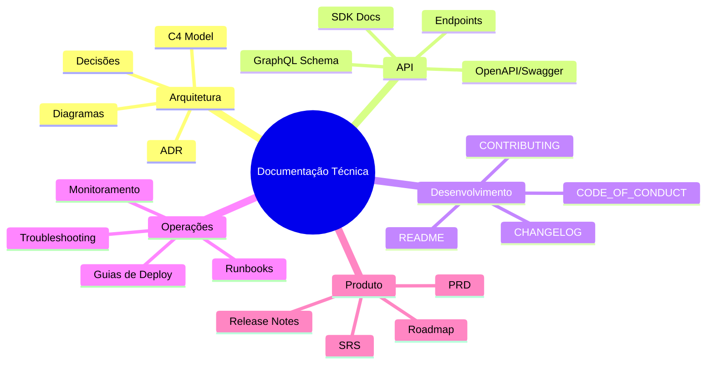
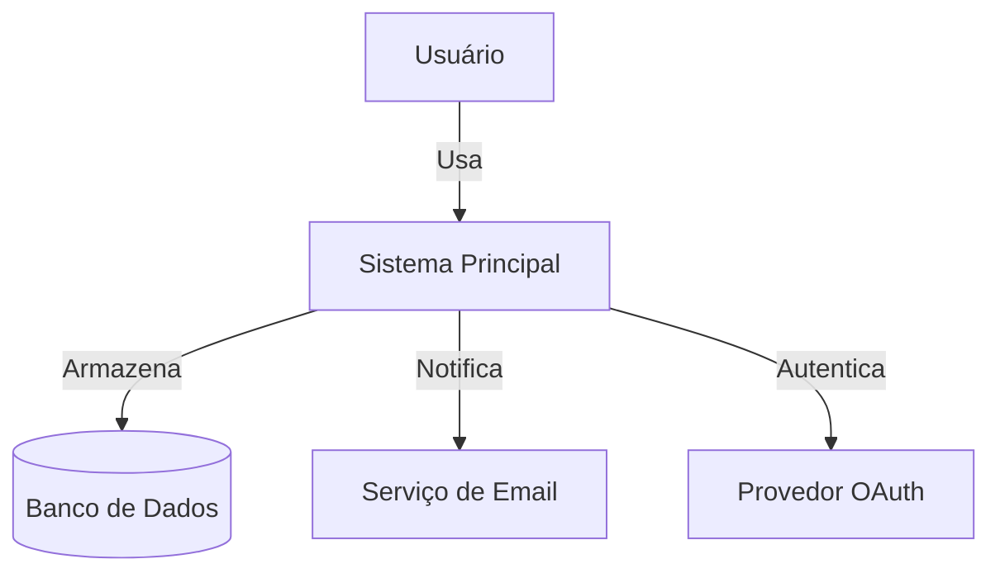

# Technical Documentation — Documentação Técnica

Skill para criação de documentação técnica de qualidade profissional. Cobre formatos, padrões e processos para todos os tipos de documentação de software.

---

## 1. Tipos de Documentação



---

## 2. Architecture Decision Records (ADR)

### Template Padrão

```markdown
# ADR-{NNN}: {Título da Decisão}

**Status:** Proposed | Accepted | Deprecated | Superseded by ADR-XXX
**Data:** YYYY-MM-DD
**Stakeholders:** [lista de pessoas/times envolvidos]

## Contexto
[Qual é o problema? Quais forças estão em jogo? O que motivou esta decisão?]

## Decisão
[O que decidimos fazer? Seja específico e concreto.]

## Alternativas Consideradas
| Alternativa | Prós | Contras | Por que rejeitada |
|-------------|------|---------|-------------------|
| Opção A | ... | ... | ... |
| Opção B | ... | ... | ... |

## Consequências
### Positivas
- [O que ficou melhor? Mais simples? Mais rápido?]

### Negativas
- [O que ficou pior? O que perdemos? Qual o custo?]

### Riscos
- [Quais riscos esta decisão introduz?]

## Referências
- [Links para docs, issues, discussões relevantes]
```

### Quando criar um ADR:

- Escolha de tecnologia (framework, banco de dados, linguagem)
- Decisão de arquitetura (monolito vs microserviços, sync vs async)
- Padrão de design adotado
- Mudança significativa de abordagem
- Decisão de "não fazer" algo que seria esperado

### Nomeação e Localização:
- Arquivos: `.github/artifacts/docs/adr/adr-{NNN}-{slug}.md`
- Numeração sequencial: 001, 002, 003...
- Index: `.github/artifacts/docs/adr/README.md` com tabela de todos ADRs

---

## 3. Diagrama C4 Model

Usar a skill `diagramming` para gerar os diagramas. Estrutura C4:

| Nível | Nome | Descrição | Público |
|-------|------|-----------|---------|
| 1 | **Contexto** | Sistema no ambiente, usuários, sistemas externos | Todos |
| 2 | **Container** | Aplicações, bancos, serviços que compõem o sistema | Técnico amplo |
| 3 | **Componente** | Módulos dentro de cada container | Desenvolvedores |
| 4 | **Código** | Classes, funções (geralmente gerado por IDE) | Desenvolvedores |

### Exemplo — Contexto (Nível 1):



---

## 4. Documentação de API

### OpenAPI 3.0 (Swagger)

Estrutura mínima:

```yaml
openapi: "3.0.0"
info:
  title: "[Nome da API]"
  version: "1.0.0"
  description: "[Descrição da API]"
servers:
  - url: https://api.exemplo.com/v1
    description: Produção
paths:
  /recurso:
    get:
      summary: Listar recursos
      parameters:
        - name: page
          in: query
          schema:
            type: integer
          description: Número da página
      responses:
        '200':
          description: Lista de recursos
          content:
            application/json:
              schema:
                type: array
                items:
                  $ref: '#/components/schemas/Recurso'
components:
  schemas:
    Recurso:
      type: object
      properties:
        id:
          type: string
        nome:
          type: string
```

### Boas Práticas:
- Documentar TODOS os códigos de resposta (200, 400, 401, 403, 404, 500)
- Incluir exemplos de request/response
- Documentar headers de autenticação
- Versionar a API (v1, v2 no path ou header)
- Usar `$ref` para evitar duplicação de schemas

---

## 5. README.md — Template

```markdown
# [Nome do Projeto]

[Badges: build, coverage, license, version]

> [Tagline — uma frase que descreve o projeto]

## 📋 Índice

- [Sobre](#sobre)
- [Começando](#começando)
- [Documentação](#documentação)
- [Contribuindo](#contribuindo)
- [Licença](#licença)

## 📖 Sobre

[2-3 parágrafos explicando o projeto, seu propósito e diferenciais]

### Tech Stack

- **Frontend:** [tecnologias]
- **Backend:** [tecnologias]
- **Banco de Dados:** [tecnologias]
- **Infra:** [tecnologias]

## 🚀 Começando

### Pré-requisitos

- [Ferramenta X] >= versão Y
- [Ferramenta Z]

### Instalação

\`\`\`bash
git clone [url]
cd [projeto]
[comandos de setup]
\`\`\`

### Uso Básico

\`\`\`[linguagem]
[código de exemplo mínimo]
\`\`\`

## 📚 Documentação

- [Guia de Arquitetura](docs/arquitetura.md)
- [Documentação da API](docs/api.md)
- [Guia de Contribuição](CONTRIBUTING.md)
- [ADRs](docs/adr/)

## 🤝 Contribuindo

Veja [CONTRIBUTING.md](CONTRIBUTING.md) para o guia completo.

## 📄 Licença

Este projeto está sob a licença [NOME]. Veja [LICENSE](LICENSE) para detalhes.
```

---

## 6. CHANGELOG.md

Seguir [Keep a Changelog](https://keepachangelog.com/) + [Semantic Versioning](https://semver.org/):

```markdown
# Changelog

## [1.1.0] - 2026-07-25

### Added
- Nova funcionalidade X

### Changed
- Melhoria na performance do módulo Y

### Deprecated
- Método antigo `doSomething()` será removido na v2.0

### Fixed
- Bug na validação de email (#123)

### Security
- Atualizada dependência com vulnerabilidade CVE-XXXX-XXXXX

## [1.0.0] - 2026-06-01

### Added
- Lançamento inicial
```

---

## 7. Procedimento

### Ao criar documentação:

1. **Identificar o tipo** — ADR, API, README, Guia, etc.
2. **Identificar o público-alvo** — Desenvolvedor, arquiteto, operador, stakeholder
3. **Escolher o template** — Usar os templates acima
4. **Coletar informações** — Explorar código, entrevistar time, revisar issues
5. **Escrever** — Claro, conciso, objetivo. Evitar jargão desnecessário.
6. **Revisar** — Verificar completude, precisão técnica, legibilidade
7. **Salvar** — Artefato em local apropriado do projeto

### Regras:
- SEMPRE use `vscode_askQuestions` para interagir com o usuário
- SEMPRE use `manage_todo_list` para estruturar as etapas
- SEMPRE salve artefatos em `.github/artifacts/docs/`
- Use a skill `diagramming` para criar diagramas de arquitetura
- Documentação é código — mantenha atualizada ou remova
